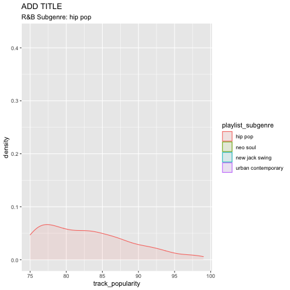

```{r setup, include=FALSE}
#knitr::opts_chunk$set(echo = TRUE, error=TRUE, message=FALSE, warning=FALSE)
```

```{r}
#loading packages
library(lubridate)
library(dplyr)
library(tidyverse)
library(ggridges) # for joy plots
library(plotly) 
library(gganimate)     # for adding animation layers to ggplots
library(gifski)        # for creating the gif (don't need to load this library every time,but need it installed)
```

```{r}
#loading data
spotify <- readr::read_csv('https://raw.githubusercontent.com/rfordatascience/tidytuesday/master/data/2020/2020-01-21/spotify_songs.csv')

spotify_rap <- spotify %>% 
  filter(playlist_genre == "rap")

randb <- spotify %>%
  filter(playlist_genre == "r&b") %>%
  select(-track_id, - track_album_id, -playlist_id, -playlist_name) %>%
  filter(track_popularity >= 75)
```

# Introduction & Background


Who hasn't been in a "aaah, I know this song" moment but didn't know where they knew it from?  Or even worse, singing the lyrics of a song you hate because you couldn't help but memorize them since the track was playing everywhere. Chances are, you heard that tune on the car radio when your phone's battery died or maybe even at the store when you went to buy a charger for your phone. The 
Why did we do an analysis on spotify? Why is the data significant & why should people care? Introduce the data to audience

Using this dataset, we hope to study to technicalities of music anbd

Aside from personal interest...

## Data Collection
Data retrieved from github, (add link).
https://github.com/rfordatascience/tidytuesday/blob/faca0b6bd282998693007c329e3f4b917a5fd7a8/data/2020/2020-01-21/readme.md
Who collected the data and what prupose does it serve? Who funded the data collection? Any possible biases?
What are teh implications of the analysis of this dataset, ethical or otherwise?

## How has the popularity of genres changed over time?

```{r}
genre_pop <- spotify %>%
  filter(track_popularity >= 75) %>%
    mutate(ymd_release = ymd(track_album_release_date),
         year = year(ymd_release)) %>%
  group_by(year, playlist_genre) %>%
  summarize(avg_popularity = mean(track_popularity)) %>%
  ggplot(aes(x = year, y = avg_popularity, color = playlist_genre)) +
  geom_point() +
  labs(title="Average song popularity by genre per year",
       subtitle = "Overall, as music becomes more accessible, average peopulatity across all genres is on the rise.",
       x = "",
       y = "",
       color = "Genre") +
  theme_classic()

ggplotly(genre_pop)
```


```{r}
prelim_graph <- spotify %>%
  ggplot(aes(y = playlist_genre, x = track_popularity)) +
  labs(title = "Song Popularity by Genre",
       x = "", y = "",
       subtitle = "Song popularity is measured from 0-100, with higher numbers being indiciative of more popularity.\nHighest median popularities belong to pop and latin with an overall median popularity of 40",
       caption = "Alex Ismail, Malek Kaloti, Brian Lee") +
  theme_classic() + 
  theme(plot.title.position = "plot",
        plot.title = element_text(size = 20, face = "bold"),
        plot.subtitle = element_text(size = 10, face = "italic")) +
  geom_boxplot() +
  geom_vline(aes(xintercept = median(track_popularity, na.rm = TRUE)), color = "blue") 

prelim_graph
```


# Analysis!

## Rap

Rap is a particularly fascinating genre to investigate using the Spotify data to look at what traits of music have correlated with popularity as the genre has undergone several changes in audience and style. Though a relatively new genre arriving on the greater music scene in the 80s, rap has undergone a myriad of trends and style variations. Fans of old school rap from the 80s and 90s may have distaste for today's artists like Drake and Eminem for having modernized the genre too much. Fans of modern rap may get bored of the authentic sound of artists like Run-DMC or Tupac. Are there trends that tie all of rap together as to what makes a song popular? 

### Song Quality

The first and most natural observations to make are on overarching metrics that Spotify provides. Using the descriptions provided, I was most interested on the following values in correlation to track popularity: Danceability due to rap's heavy emphasis on rhythm and beats, Energy due to some artists' signature style of shouting to "hype" up a crowd (ie. Lil Jon, DMX), the inverse variables of Speechiness/Instrumentalness due to other artist's signature of rapping as fast as possible (ie. Eminem, Busta Rhymes), and Valence for the perceived association between rap and violence, drugs, and focus on other less-than-righteous topics.

```{r, echo=FALSE}
spotify_rap %>% 
  mutate(Rounded_Danceability = round(danceability, digits = 1),
         Rounded_Energy = round(energy, digits = 1),
         Rounded_Speechiness = round(speechiness, digits = 1),
         Rounded_Instrumental = round(instrumentalness, digits = 1),
         Rounded_Valence = round(valence, digits = 1),
         popular = track_popularity > 75) %>% 
  pivot_longer(cols = starts_with("Rounded"),
               names_to = "Stat1",
               values_to = "Rounded_Value") %>% 
  group_by(Stat1, Rounded_Value) %>% 
  summarize(Pop_Rate = mean(popular)*100) %>% 
  mutate(Stat = fct_recode(Stat1, 
                             Danceability = "Rounded_Danceability",
                             Energy = "Rounded_Energy",
                             Speechiness = "Rounded_Speechiness",
                             Instrumental = "Rounded_Instrumental",
                             Valence = "Rounded_Valence")) %>% 
  ggplot(aes(x = Rounded_Value, y = Pop_Rate)) +
  geom_line(aes(color = Stat)) +
  labs(title = "Popularity of Rap Songs by Song Characteristic",
       x = "", y = "Percent Popular", color = "Song Statistic") +
  theme_classic() + 
  theme(plot.title.position = "plot",
        plot.title = element_text(size = 20, face = "bold"),
        plot.subtitle = element_text(size = 10, face = "italic"))
```

Oddly, the biggest conclusion I drew from this graph was not any positive or negative correlation, but a lack of connection between valence and popularity. For a genre that has a reputation for being connected with gangs, guns, drugs, etc., there is a complete lack of correlation between valence and popularity. Beyond that, there is a moderately strong correlation between popularity and danceability, as I had expected based on the prevalence of beats and rhythms in rap. The energy line shows that the highest percentage of songs to become popular are ~.5 energy, which likely suggests too much energy can take away from the popularity of a song. Finally, the speechiness/instrumentalness variable shows that songs on the extreme end of speechiness (.8+) are most likely to be popular.

### Do songs with multiple artists become popular at a higher rate?

Beyond the stats, there was one more observation I wanted to make on rap music. Based on my experience listening to rap, some of my favorite songs are remixes, features, or any other way multiple artists can put verses on the same song. Songs like "Life is Good" by Drake and Future, or remixes to songs like "HIGHEST IN THE ROOM" which incorporates Lil Baby in a song by Travis Scott add a certain level of freshness and break up three consecutive minutes of one artist rapping into fun back and forths with styles. Below is a graphic comparing the popularity rates of those songs vs solo songs between rap and other genres.

```{r fig.width = 9, fig.length = 6}
Multiple_Artist_Graph <- spotify %>% 
  mutate(track_name_lower = str_to_lower(track_name),
         remix = str_detect(track_name_lower, "Remix"),
         feature = str_detect(track_name_lower, "feat"),
         ma_prep = remix|feature,
         ma_prep2 = replace_na(ma_prep, FALSE),
         multiple_artists = if_else(ma_prep2, true = "Multiple Artists", false = "One Artist"),
         popular = track_popularity > 75) %>% 
  group_by(multiple_artists, playlist_genre) %>% 
  summarize(prop_pop = mean(popular)*100) %>% 
  mutate(genre = fct_relevel(playlist_genre, "rap")) %>% 
  ggplot() +
  geom_col(aes(x = multiple_artists, y = prop_pop), fill = "black") +
  facet_wrap(~genre) +
  labs(title = "Popularity of Songs Containing Mulitple Artists Across Genre",
       x = "", y = "Percent of Songs Popular") +
  theme_classic() + 
  theme(plot.title.position = "plot",
        plot.title = element_text(size = 20, face = "bold"),
        plot.subtitle = element_text(size = 10, face = "italic"))

ggplotly(Multiple_Artist_Graph)
```

Rap had the largest change between songs with multiple artists and song with only one, with a gap of 10%. Based on other genres' disparity like R&B and pop, I hypothesize that these trends are connected with the modern day music scene. Collaboration between artists at the top of their field has become more commonplace, even with some mega-tracks like "Forever" with verses from Eminem, Kanye West, Drake, and Lil Wayne all in the same song. These collaborations can create songs with blended styles, which even furthers the development of rap as a unique genre.


## R&B

### Why R&B?

In this section, I want to take a closer look at one of my favorite genres of music, R&B. I think I love it so much because it's often good music to unwind to -- it's smooth, slow, and relaxing. I also love its versatility! R&B can fit the mood of anything from a gloomy, rainy day to a bright, sunny day. But why? What characteristics make R&B such a great genre to listen to? Using the Spotify dataset and some visualizations which look at the specific characteristics of the most popular R&B songs (songs with a popularity rating of above 75), I hope to come closer to answering these questions.

```{r}
randb %>%
  select(track_name, track_artist, playlist_genre, playlist_subgenre, track_popularity, danceability, energy, loudness, mode, speechiness, acousticness, instrumentalness, liveness, valence, duration_ms) %>%
  arrange(desc(track_popularity)) %>%
  head(12) %>%
  knitr::kable() 
```

Above are the top 10 most popular songs in the R&B genre (12 songs were pulled from the dataset to account for 2 songs that were each in 2 different subgenres -- Arizona Zeravas' *Roxanne* and The Weeknd's *Blinding Lights*. We can see that all of them were released in 2019 and all categorized under my two favorite two subgenres of R&B, Urban Contemporary and Hip Pop. All of them also boast a danceability score of above 0.5, with most of them (with the exception of Maroon 5's *Memories* and Billie Eilish's *everything i wanted*) having energy scores of above 0.5. We can also see that across the board, all 10 songs have low speechiness and instrumentalness scores (with the exception of Billie Eilish's *everything i wanted*. Interestingly, all of the songs fall within a valence of 0.2-0.6. The other characteristics are quite varied. So, for the purposes of my analysis of the R&B genre, I will only focus on the song characteristics that have clear trends across the genre -- danceabiility, energy, speechiness, instrumentalness, and valence.

### Which subgenres have the most popular songs?

In the exploratory phase of my analysis of the R&B genre, the most obvious characteristic of a song in the R&B genre was a song's subgenre. Are certain genres more likely to have more popular songs because some have more fans and listeners than others? In the density plot below, we see that this is the case -- Neo-Soul and New Jack Swing have the highest quantity of popular songs. 

```{r fig.width = 7, fig.length = 5, eval = FALSE}
randb %>% 
  ggplot(aes(x = track_popularity, fill = playlist_subgenre)) +
  geom_density(alpha = 0.1) +
  theme_classic() +
  labs(title = "Do certain subgenres have more popular songs?",
       subtitle = "This density plot only includes songs with a popularity of >=75.\nIt seems that Neo-Soul and New Jack Swing have the most popular songs.\n\nR&B Subgenre: {closest_state}",
       x = "Track Popularity",
       y = "",
       fill = "R&B subgenre",
       caption = "Visualization created by Brian Lee") +
  transition_states(playlist_subgenre, transition_length = 3, state_length = 1)
#get rid of axes, make subtitle descriptive
anim_save("randb_density.gif")
```

```{r}

```

In the density plot above, Neo-Soul and New Jack Swing both seem to have a lot of popular songs on the lower end of the spectrum (75-85), with Urban Contemporary and Hip Pop following similar trends, but in comparison to the other two genres, their density curves are not as large, signaling that the former two genres have more songs classified as "popular" than teh latter two.

I believe that this trend could be occurring because of the huge increase in the production of hip pop and urban contemporary music. With streaming services such as Spotify making it easier than ever for small creators to attain platforms and with the advancement of technology making it easier to produce and release music from one's own bedroom, this may be because of the oversaturation of the music industry -- there are more songs being released than ever.

```{r}
randb %>%
  group_by(playlist_subgenre) %>%
  summarize(num_of_songs = n(), avg_pop = mean(track_popularity)) %>%
  knitr::kable() 
```

Despite the large density curves, on average, hip pop and urban contemporary are slightly more popular than the Neo-Soul and New Jack Swing. Another interesting observation we can make is the sheer lack of popular songs for Neo-Soul and New Jack Swing. 

A quick Google search will reveal that both Neo-Soul and New Jack Swing were subgenres of R&B that were popular during the 1980's/90's. Their large density curves could be due to this fact. Because the technology for household high quality handheld microphones and producing equipment was not in abundance like it is now, artists had to rely on label companies and managers for the funding to acquire the money for studios and expensive equipment, thus leading to less music being produced. Additionally, because labeling agencies and managerial agencies essentially "invested" in discovered artists whom they knew they would get a high profit margin from, the discovered artists who were given a platform by these agencies were more likely to be successful. With a smaller pool of music and more popular songs making up that small poool of music, large density curves such as the ones we see in the visualization above for Neo-Soul and New Jack Swing are possible, and could serve as an explanation for the difference in the quantity between the four genres.

As I move forward in my analysis to look at the specific characteristics of popular R&B songs, I will restrict myself to the two subgenres with more cases to look at and my person two favorite subgenres -- Hip-Pop and Urban Contemporary.

### Taking a closer look at the specific characteristis of popular songs in the Hip-Pop and Urban Contemporary Subgenres

```{r}
randb %>%
  group_by(playlist_subgenre) %>%
  filter(playlist_subgenre == c("hip pop", "urban contemporary")) %>%
  summarise_at(c("track_popularity", "danceability", "energy", "speechiness", "instrumentalness", "valence"), mean, na.rm = TRUE) %>%
  knitr::kable() 
# Add graph
```

# What now? Why is our analysis important?

As it becomes easier to produce and release music from one's own bedroom and streaming platforms such as Apple Music and Spotify increasingly making music accessible to everyone, we believe our analysis has important implications which can help listeners find new songs that they like and help platforms build algorithms that give better and more relevant song recommendations to its users. 

### A disclaimer: Correlation does no equal causation.

Of course, carrelation does not equal causation. Just because the 

## A Conclusion
Thanks to streaming platforms such as Spotify and Apple Music, small creators are also given a platform for creative release. Our analyses of pop, rap, and R&B, can also help small artists grow their own platforms to cater to the interests of specific audiences. In a time such as now when the consumption of art (whether it be in the form of movies, music, or television), is essential to one's mental wellbeing, our analysis can help boost these efforts. By asking the question, "What makes a song in a given genre popular?" We have taken a close look at the specific characteristics of songs with a popularity rating of 75 or higher.


