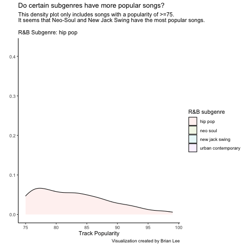

```r
#loading packages
library(lubridate)
library(dplyr)
library(tidyverse)
library(plotly) 
library(gganimate)     # for adding animation layers to ggplots
library(gifski)        # for creating the gif (don't need to load this library every time,but need it installed)
library(gt) 
```


```r
#loading data
spotify <- readr::read_csv('https://raw.githubusercontent.com/rfordatascience/tidytuesday/master/data/2020/2020-01-21/spotify_songs.csv')

spotify_rap <- spotify %>% 
  filter(playlist_genre == "rap")

randb <- spotify %>%
  filter(playlist_genre == "r&b") %>%
  select(-track_id, - track_album_id, -playlist_id, -playlist_name) %>%
  filter(track_popularity >= 75)
```

# Introduction & Background

A noticeable trend in the entertainment industry has been the transformation from physical to digitalized content. Newspapers are replaced with online articles, Netflix replaced Blockbuster, and online music streaming sites like Spotify have taken over traditonal music media as the primary source of music for millions. In addition to expanding the reach of music to new people, the transition to using Spotify has come with new ways to analyze music tastes, both individually and as a population. Spotify users have access to new daily playlists tailored to their individual preferences, in addition to having suggested music based of the data provided to Spotify of listening habits. In our analysis of the characteristics of songs, we hope to make obserations to help pinpoint what exactly makes a song popular.

## Data Collection

Retrieved from a past Tidy Tuesday dataset, we will be using data from Spotify for our analysis. The link to the repository can be can be accessed [here](https://github.com/rfordatascience/tidytuesday/blob/faca0b6bd282998693007c329e3f4b917a5fd7a8/data/2020/2020-01-21/readme.md)

Using data collected by Spotify, we will investigate how certain aspects of a song, such as genre, subgenre, release date, and other more complex measurements correlate to how popular a song is. Popularity is rated on a scale to 100 with the most popular songs on Spotify as of February 2020 will have a score near 100. We identified popularity scores greater than 75 to be a convenient threshold to deem a song "popular".

# A Preliminary Analysis

## How has the popularity of genres changed over time?


```r
genre_pop <- spotify %>%
  filter(track_popularity >= 75) %>%
    mutate(ymd_release = ymd(track_album_release_date),
         year = year(ymd_release)) %>%
  group_by(year, playlist_genre) %>%
  summarize(avg_popularity = mean(track_popularity)) %>%
  ggplot(aes(x = year, y = avg_popularity, color = playlist_genre)) +
  geom_point() +
  labs(title="Average song popularity by genre per year",
       subtitle = "Overall, as music becomes more accessible, average peopulatity across all genres is on the rise.",
       x = "",
       y = "",
       color = "Genre") +
  theme_classic()

ggplotly(genre_pop)
```

<!--html_preserve--><div id="htmlwidget-50800039caf922423da6" style="width:672px;height:480px;" class="plotly html-widget"></div>
<script type="application/json" data-for="htmlwidget-50800039caf922423da6">{"x":{"data":[{"x":[2002,2006,2007,2008,2009,2010,2011,2012,2013,2014,2015,2016,2017,2018,2019,2020,null],"y":[83,77,79,76,78,77.5,77,77.6428571428571,78.1428571428571,79.5384615384615,78.3636363636364,79.695652173913,78.8666666666667,81.7826086956522,84.2222222222222,86.1111111111111,77.5],"text":["year: 2002<br />avg_popularity: 83.00000<br />playlist_genre: edm","year: 2006<br />avg_popularity: 77.00000<br />playlist_genre: edm","year: 2007<br />avg_popularity: 79.00000<br />playlist_genre: edm","year: 2008<br />avg_popularity: 76.00000<br />playlist_genre: edm","year: 2009<br />avg_popularity: 78.00000<br />playlist_genre: edm","year: 2010<br />avg_popularity: 77.50000<br />playlist_genre: edm","year: 2011<br />avg_popularity: 77.00000<br />playlist_genre: edm","year: 2012<br />avg_popularity: 77.64286<br />playlist_genre: edm","year: 2013<br />avg_popularity: 78.14286<br />playlist_genre: edm","year: 2014<br />avg_popularity: 79.53846<br />playlist_genre: edm","year: 2015<br />avg_popularity: 78.36364<br />playlist_genre: edm","year: 2016<br />avg_popularity: 79.69565<br />playlist_genre: edm","year: 2017<br />avg_popularity: 78.86667<br />playlist_genre: edm","year: 2018<br />avg_popularity: 81.78261<br />playlist_genre: edm","year: 2019<br />avg_popularity: 84.22222<br />playlist_genre: edm","year: 2020<br />avg_popularity: 86.11111<br />playlist_genre: edm","year:   NA<br />avg_popularity: 77.50000<br />playlist_genre: edm"],"type":"scatter","mode":"markers","marker":{"autocolorscale":false,"color":"rgba(248,118,109,1)","opacity":1,"size":5.66929133858268,"symbol":"circle","line":{"width":1.88976377952756,"color":"rgba(248,118,109,1)"}},"hoveron":"points","name":"edm","legendgroup":"edm","showlegend":true,"xaxis":"x","yaxis":"y","hoverinfo":"text","frame":null},{"x":[1987,1988,1995,1997,1999,2003,2004,2005,2008,2009,2010,2011,2012,2013,2014,2015,2016,2017,2018,2019,2020,null],"y":[77,75,80,75,76,75,77.5,77.5,77.6666666666667,77,77.0769230769231,77.3333333333333,77.75,79.75,78.4285714285714,77.5,80,78.2692307692308,80.6826923076923,83.488120950324,84.2916666666667,78],"text":["year: 1987<br />avg_popularity: 77.00000<br />playlist_genre: latin","year: 1988<br />avg_popularity: 75.00000<br />playlist_genre: latin","year: 1995<br />avg_popularity: 80.00000<br />playlist_genre: latin","year: 1997<br />avg_popularity: 75.00000<br />playlist_genre: latin","year: 1999<br />avg_popularity: 76.00000<br />playlist_genre: latin","year: 2003<br />avg_popularity: 75.00000<br />playlist_genre: latin","year: 2004<br />avg_popularity: 77.50000<br />playlist_genre: latin","year: 2005<br />avg_popularity: 77.50000<br />playlist_genre: latin","year: 2008<br />avg_popularity: 77.66667<br />playlist_genre: latin","year: 2009<br />avg_popularity: 77.00000<br />playlist_genre: latin","year: 2010<br />avg_popularity: 77.07692<br />playlist_genre: latin","year: 2011<br />avg_popularity: 77.33333<br />playlist_genre: latin","year: 2012<br />avg_popularity: 77.75000<br />playlist_genre: latin","year: 2013<br />avg_popularity: 79.75000<br />playlist_genre: latin","year: 2014<br />avg_popularity: 78.42857<br />playlist_genre: latin","year: 2015<br />avg_popularity: 77.50000<br />playlist_genre: latin","year: 2016<br />avg_popularity: 80.00000<br />playlist_genre: latin","year: 2017<br />avg_popularity: 78.26923<br />playlist_genre: latin","year: 2018<br />avg_popularity: 80.68269<br />playlist_genre: latin","year: 2019<br />avg_popularity: 83.48812<br />playlist_genre: latin","year: 2020<br />avg_popularity: 84.29167<br />playlist_genre: latin","year:   NA<br />avg_popularity: 78.00000<br />playlist_genre: latin"],"type":"scatter","mode":"markers","marker":{"autocolorscale":false,"color":"rgba(183,159,0,1)","opacity":1,"size":5.66929133858268,"symbol":"circle","line":{"width":1.88976377952756,"color":"rgba(183,159,0,1)"}},"hoveron":"points","name":"latin","legendgroup":"latin","showlegend":true,"xaxis":"x","yaxis":"y","hoverinfo":"text","frame":null},{"x":[1969,1978,1980,1982,1983,1984,1985,1987,1988,1989,1990,1991,1994,1995,1996,1999,2000,2001,2002,2003,2004,2005,2007,2008,2009,2010,2011,2012,2013,2014,2015,2016,2017,2018,2019,2020,null],"y":[80,75,80.5,77,79.3333333333333,77,83,78.5,76,75,81,81,79,80,79,76.3333333333333,78.5,75.5,77.75,78,77.6666666666667,79.25,76.6,78,76.8333333333333,77.9,78.6190476190476,77.0322580645161,78.4333333333333,78.5277777777778,78.0816326530612,79.2571428571429,79.7875,80.7238805970149,84.2132352941177,86.4545454545455,77],"text":["year: 1969<br />avg_popularity: 80.00000<br />playlist_genre: pop","year: 1978<br />avg_popularity: 75.00000<br />playlist_genre: pop","year: 1980<br />avg_popularity: 80.50000<br />playlist_genre: pop","year: 1982<br />avg_popularity: 77.00000<br />playlist_genre: pop","year: 1983<br />avg_popularity: 79.33333<br />playlist_genre: pop","year: 1984<br />avg_popularity: 77.00000<br />playlist_genre: pop","year: 1985<br />avg_popularity: 83.00000<br />playlist_genre: pop","year: 1987<br />avg_popularity: 78.50000<br />playlist_genre: pop","year: 1988<br />avg_popularity: 76.00000<br />playlist_genre: pop","year: 1989<br />avg_popularity: 75.00000<br />playlist_genre: pop","year: 1990<br />avg_popularity: 81.00000<br />playlist_genre: pop","year: 1991<br />avg_popularity: 81.00000<br />playlist_genre: pop","year: 1994<br />avg_popularity: 79.00000<br />playlist_genre: pop","year: 1995<br />avg_popularity: 80.00000<br />playlist_genre: pop","year: 1996<br />avg_popularity: 79.00000<br />playlist_genre: pop","year: 1999<br />avg_popularity: 76.33333<br />playlist_genre: pop","year: 2000<br />avg_popularity: 78.50000<br />playlist_genre: pop","year: 2001<br />avg_popularity: 75.50000<br />playlist_genre: pop","year: 2002<br />avg_popularity: 77.75000<br />playlist_genre: pop","year: 2003<br />avg_popularity: 78.00000<br />playlist_genre: pop","year: 2004<br />avg_popularity: 77.66667<br />playlist_genre: pop","year: 2005<br />avg_popularity: 79.25000<br />playlist_genre: pop","year: 2007<br />avg_popularity: 76.60000<br />playlist_genre: pop","year: 2008<br />avg_popularity: 78.00000<br />playlist_genre: pop","year: 2009<br />avg_popularity: 76.83333<br />playlist_genre: pop","year: 2010<br />avg_popularity: 77.90000<br />playlist_genre: pop","year: 2011<br />avg_popularity: 78.61905<br />playlist_genre: pop","year: 2012<br />avg_popularity: 77.03226<br />playlist_genre: pop","year: 2013<br />avg_popularity: 78.43333<br />playlist_genre: pop","year: 2014<br />avg_popularity: 78.52778<br />playlist_genre: pop","year: 2015<br />avg_popularity: 78.08163<br />playlist_genre: pop","year: 2016<br />avg_popularity: 79.25714<br />playlist_genre: pop","year: 2017<br />avg_popularity: 79.78750<br />playlist_genre: pop","year: 2018<br />avg_popularity: 80.72388<br />playlist_genre: pop","year: 2019<br />avg_popularity: 84.21324<br />playlist_genre: pop","year: 2020<br />avg_popularity: 86.45455<br />playlist_genre: pop","year:   NA<br />avg_popularity: 77.00000<br />playlist_genre: pop"],"type":"scatter","mode":"markers","marker":{"autocolorscale":false,"color":"rgba(0,186,56,1)","opacity":1,"size":5.66929133858268,"symbol":"circle","line":{"width":1.88976377952756,"color":"rgba(0,186,56,1)"}},"hoveron":"points","name":"pop","legendgroup":"pop","showlegend":true,"xaxis":"x","yaxis":"y","hoverinfo":"text","frame":null},{"x":[1971,1986,1987,1990,1994,1996,1999,2000,2002,2003,2004,2006,2008,2010,2012,2013,2014,2015,2016,2017,2018,2019,2020,null],"y":[76,79,80,75,90,76,77.5,77,77,78,77,76,77,77.5,75,79.6666666666667,77.6,77.9166666666667,79.1666666666667,79.1935483870968,81.8369565217391,84.1321428571429,84,77.3333333333333],"text":["year: 1971<br />avg_popularity: 76.00000<br />playlist_genre: r&b","year: 1986<br />avg_popularity: 79.00000<br />playlist_genre: r&b","year: 1987<br />avg_popularity: 80.00000<br />playlist_genre: r&b","year: 1990<br />avg_popularity: 75.00000<br />playlist_genre: r&b","year: 1994<br />avg_popularity: 90.00000<br />playlist_genre: r&b","year: 1996<br />avg_popularity: 76.00000<br />playlist_genre: r&b","year: 1999<br />avg_popularity: 77.50000<br />playlist_genre: r&b","year: 2000<br />avg_popularity: 77.00000<br />playlist_genre: r&b","year: 2002<br />avg_popularity: 77.00000<br />playlist_genre: r&b","year: 2003<br />avg_popularity: 78.00000<br />playlist_genre: r&b","year: 2004<br />avg_popularity: 77.00000<br />playlist_genre: r&b","year: 2006<br />avg_popularity: 76.00000<br />playlist_genre: r&b","year: 2008<br />avg_popularity: 77.00000<br />playlist_genre: r&b","year: 2010<br />avg_popularity: 77.50000<br />playlist_genre: r&b","year: 2012<br />avg_popularity: 75.00000<br />playlist_genre: r&b","year: 2013<br />avg_popularity: 79.66667<br />playlist_genre: r&b","year: 2014<br />avg_popularity: 77.60000<br />playlist_genre: r&b","year: 2015<br />avg_popularity: 77.91667<br />playlist_genre: r&b","year: 2016<br />avg_popularity: 79.16667<br />playlist_genre: r&b","year: 2017<br />avg_popularity: 79.19355<br />playlist_genre: r&b","year: 2018<br />avg_popularity: 81.83696<br />playlist_genre: r&b","year: 2019<br />avg_popularity: 84.13214<br />playlist_genre: r&b","year: 2020<br />avg_popularity: 84.00000<br />playlist_genre: r&b","year:   NA<br />avg_popularity: 77.33333<br />playlist_genre: r&b"],"type":"scatter","mode":"markers","marker":{"autocolorscale":false,"color":"rgba(0,191,196,1)","opacity":1,"size":5.66929133858268,"symbol":"circle","line":{"width":1.88976377952756,"color":"rgba(0,191,196,1)"}},"hoveron":"points","name":"r&b","legendgroup":"r&b","showlegend":true,"xaxis":"x","yaxis":"y","hoverinfo":"text","frame":null},{"x":[1974,1982,1994,1995,1996,1997,1999,2000,2002,2003,2004,2005,2007,2008,2011,2012,2013,2014,2015,2016,2017,2018,2019,2020,null],"y":[81,77,76,80,76.2,75,75,78.5,80,77,79,76,76,79,77,76,75,82,76.6363636363636,79.6666666666667,79.4761904761905,80.2333333333333,82.0657276995305,81.3333333333333,79],"text":["year: 1974<br />avg_popularity: 81.00000<br />playlist_genre: rap","year: 1982<br />avg_popularity: 77.00000<br />playlist_genre: rap","year: 1994<br />avg_popularity: 76.00000<br />playlist_genre: rap","year: 1995<br />avg_popularity: 80.00000<br />playlist_genre: rap","year: 1996<br />avg_popularity: 76.20000<br />playlist_genre: rap","year: 1997<br />avg_popularity: 75.00000<br />playlist_genre: rap","year: 1999<br />avg_popularity: 75.00000<br />playlist_genre: rap","year: 2000<br />avg_popularity: 78.50000<br />playlist_genre: rap","year: 2002<br />avg_popularity: 80.00000<br />playlist_genre: rap","year: 2003<br />avg_popularity: 77.00000<br />playlist_genre: rap","year: 2004<br />avg_popularity: 79.00000<br />playlist_genre: rap","year: 2005<br />avg_popularity: 76.00000<br />playlist_genre: rap","year: 2007<br />avg_popularity: 76.00000<br />playlist_genre: rap","year: 2008<br />avg_popularity: 79.00000<br />playlist_genre: rap","year: 2011<br />avg_popularity: 77.00000<br />playlist_genre: rap","year: 2012<br />avg_popularity: 76.00000<br />playlist_genre: rap","year: 2013<br />avg_popularity: 75.00000<br />playlist_genre: rap","year: 2014<br />avg_popularity: 82.00000<br />playlist_genre: rap","year: 2015<br />avg_popularity: 76.63636<br />playlist_genre: rap","year: 2016<br />avg_popularity: 79.66667<br />playlist_genre: rap","year: 2017<br />avg_popularity: 79.47619<br />playlist_genre: rap","year: 2018<br />avg_popularity: 80.23333<br />playlist_genre: rap","year: 2019<br />avg_popularity: 82.06573<br />playlist_genre: rap","year: 2020<br />avg_popularity: 81.33333<br />playlist_genre: rap","year:   NA<br />avg_popularity: 79.00000<br />playlist_genre: rap"],"type":"scatter","mode":"markers","marker":{"autocolorscale":false,"color":"rgba(97,156,255,1)","opacity":1,"size":5.66929133858268,"symbol":"circle","line":{"width":1.88976377952756,"color":"rgba(97,156,255,1)"}},"hoveron":"points","name":"rap","legendgroup":"rap","showlegend":true,"xaxis":"x","yaxis":"y","hoverinfo":"text","frame":null},{"x":[1965,1968,1969,1970,1971,1972,1973,1974,1975,1976,1977,1978,1979,1980,1981,1982,1983,1984,1985,1986,1987,1989,1990,1991,1992,1993,1994,1995,1997,1998,1999,2000,2001,2002,2003,2004,2005,2006,2007,2008,2009,2011,2012,2013,2014,2015,2016,2017,2018,2019,null],"y":[76,76,77.2857142857143,77.3333333333333,77.1666666666667,76.5,76.8,81,76.875,80.3333333333333,77.6666666666667,77.5,79.2857142857143,80.3333333333333,76,81,79.6,76.5,80.2,79,79.2307692307692,75.5,78.5,77.8571428571429,75,77.3333333333333,78.6,79,77.25,75.6,78.8333333333333,82.3333333333333,78,76.25,79.5,77.1666666666667,77.4,76.875,76,76.8333333333333,75,79.3333333333333,75,77.6666666666667,81,84.3333333333333,79,78.6,81.3333333333333,82.3333333333333,76.9268292682927],"text":["year: 1965<br />avg_popularity: 76.00000<br />playlist_genre: rock","year: 1968<br />avg_popularity: 76.00000<br />playlist_genre: rock","year: 1969<br />avg_popularity: 77.28571<br />playlist_genre: rock","year: 1970<br />avg_popularity: 77.33333<br />playlist_genre: rock","year: 1971<br />avg_popularity: 77.16667<br />playlist_genre: rock","year: 1972<br />avg_popularity: 76.50000<br />playlist_genre: rock","year: 1973<br />avg_popularity: 76.80000<br />playlist_genre: rock","year: 1974<br />avg_popularity: 81.00000<br />playlist_genre: rock","year: 1975<br />avg_popularity: 76.87500<br />playlist_genre: rock","year: 1976<br />avg_popularity: 80.33333<br />playlist_genre: rock","year: 1977<br />avg_popularity: 77.66667<br />playlist_genre: rock","year: 1978<br />avg_popularity: 77.50000<br />playlist_genre: rock","year: 1979<br />avg_popularity: 79.28571<br />playlist_genre: rock","year: 1980<br />avg_popularity: 80.33333<br />playlist_genre: rock","year: 1981<br />avg_popularity: 76.00000<br />playlist_genre: rock","year: 1982<br />avg_popularity: 81.00000<br />playlist_genre: rock","year: 1983<br />avg_popularity: 79.60000<br />playlist_genre: rock","year: 1984<br />avg_popularity: 76.50000<br />playlist_genre: rock","year: 1985<br />avg_popularity: 80.20000<br />playlist_genre: rock","year: 1986<br />avg_popularity: 79.00000<br />playlist_genre: rock","year: 1987<br />avg_popularity: 79.23077<br />playlist_genre: rock","year: 1989<br />avg_popularity: 75.50000<br />playlist_genre: rock","year: 1990<br />avg_popularity: 78.50000<br />playlist_genre: rock","year: 1991<br />avg_popularity: 77.85714<br />playlist_genre: rock","year: 1992<br />avg_popularity: 75.00000<br />playlist_genre: rock","year: 1993<br />avg_popularity: 77.33333<br />playlist_genre: rock","year: 1994<br />avg_popularity: 78.60000<br />playlist_genre: rock","year: 1995<br />avg_popularity: 79.00000<br />playlist_genre: rock","year: 1997<br />avg_popularity: 77.25000<br />playlist_genre: rock","year: 1998<br />avg_popularity: 75.60000<br />playlist_genre: rock","year: 1999<br />avg_popularity: 78.83333<br />playlist_genre: rock","year: 2000<br />avg_popularity: 82.33333<br />playlist_genre: rock","year: 2001<br />avg_popularity: 78.00000<br />playlist_genre: rock","year: 2002<br />avg_popularity: 76.25000<br />playlist_genre: rock","year: 2003<br />avg_popularity: 79.50000<br />playlist_genre: rock","year: 2004<br />avg_popularity: 77.16667<br />playlist_genre: rock","year: 2005<br />avg_popularity: 77.40000<br />playlist_genre: rock","year: 2006<br />avg_popularity: 76.87500<br />playlist_genre: rock","year: 2007<br />avg_popularity: 76.00000<br />playlist_genre: rock","year: 2008<br />avg_popularity: 76.83333<br />playlist_genre: rock","year: 2009<br />avg_popularity: 75.00000<br />playlist_genre: rock","year: 2011<br />avg_popularity: 79.33333<br />playlist_genre: rock","year: 2012<br />avg_popularity: 75.00000<br />playlist_genre: rock","year: 2013<br />avg_popularity: 77.66667<br />playlist_genre: rock","year: 2014<br />avg_popularity: 81.00000<br />playlist_genre: rock","year: 2015<br />avg_popularity: 84.33333<br />playlist_genre: rock","year: 2016<br />avg_popularity: 79.00000<br />playlist_genre: rock","year: 2017<br />avg_popularity: 78.60000<br />playlist_genre: rock","year: 2018<br />avg_popularity: 81.33333<br />playlist_genre: rock","year: 2019<br />avg_popularity: 82.33333<br />playlist_genre: rock","year:   NA<br />avg_popularity: 76.92683<br />playlist_genre: rock"],"type":"scatter","mode":"markers","marker":{"autocolorscale":false,"color":"rgba(245,100,227,1)","opacity":1,"size":5.66929133858268,"symbol":"circle","line":{"width":1.88976377952756,"color":"rgba(245,100,227,1)"}},"hoveron":"points","name":"rock","legendgroup":"rock","showlegend":true,"xaxis":"x","yaxis":"y","hoverinfo":"text","frame":null}],"layout":{"margin":{"t":43.7625570776256,"r":7.30593607305936,"b":25.5707762557078,"l":22.648401826484},"plot_bgcolor":"rgba(255,255,255,1)","paper_bgcolor":"rgba(255,255,255,1)","font":{"color":"rgba(0,0,0,1)","family":"","size":14.6118721461187},"title":{"text":"Average song popularity by genre per year","font":{"color":"rgba(0,0,0,1)","family":"","size":17.5342465753425},"x":0,"xref":"paper"},"xaxis":{"domain":[0,1],"automargin":true,"type":"linear","autorange":false,"range":[1962.25,2022.75],"tickmode":"array","ticktext":["1980","2000","2020"],"tickvals":[1980,2000,2020],"categoryorder":"array","categoryarray":["1980","2000","2020"],"nticks":null,"ticks":"outside","tickcolor":"rgba(51,51,51,1)","ticklen":3.65296803652968,"tickwidth":0.66417600664176,"showticklabels":true,"tickfont":{"color":"rgba(77,77,77,1)","family":"","size":11.689497716895},"tickangle":-0,"showline":true,"linecolor":"rgba(0,0,0,1)","linewidth":0.66417600664176,"showgrid":false,"gridcolor":null,"gridwidth":0,"zeroline":false,"anchor":"y","title":{"text":"","font":{"color":"rgba(0,0,0,1)","family":"","size":14.6118721461187}},"hoverformat":".2f"},"yaxis":{"domain":[0,1],"automargin":true,"type":"linear","autorange":false,"range":[74.25,90.75],"tickmode":"array","ticktext":["75","80","85","90"],"tickvals":[75,80,85,90],"categoryorder":"array","categoryarray":["75","80","85","90"],"nticks":null,"ticks":"outside","tickcolor":"rgba(51,51,51,1)","ticklen":3.65296803652968,"tickwidth":0.66417600664176,"showticklabels":true,"tickfont":{"color":"rgba(77,77,77,1)","family":"","size":11.689497716895},"tickangle":-0,"showline":true,"linecolor":"rgba(0,0,0,1)","linewidth":0.66417600664176,"showgrid":false,"gridcolor":null,"gridwidth":0,"zeroline":false,"anchor":"x","title":{"text":"","font":{"color":"rgba(0,0,0,1)","family":"","size":14.6118721461187}},"hoverformat":".2f"},"shapes":[{"type":"rect","fillcolor":null,"line":{"color":null,"width":0,"linetype":[]},"yref":"paper","xref":"paper","x0":0,"x1":1,"y0":0,"y1":1}],"showlegend":true,"legend":{"bgcolor":"rgba(255,255,255,1)","bordercolor":"transparent","borderwidth":1.88976377952756,"font":{"color":"rgba(0,0,0,1)","family":"","size":11.689497716895},"y":0.913385826771654},"annotations":[{"text":"Genre","x":1.02,"y":1,"showarrow":false,"ax":0,"ay":0,"font":{"color":"rgba(0,0,0,1)","family":"","size":14.6118721461187},"xref":"paper","yref":"paper","textangle":-0,"xanchor":"left","yanchor":"bottom","legendTitle":true}],"hovermode":"closest","barmode":"relative"},"config":{"doubleClick":"reset","showSendToCloud":false},"source":"A","attrs":{"9f72d29a02":{"x":{},"y":{},"colour":{},"type":"scatter"}},"cur_data":"9f72d29a02","visdat":{"9f72d29a02":["function (y) ","x"]},"highlight":{"on":"plotly_click","persistent":false,"dynamic":false,"selectize":false,"opacityDim":0.2,"selected":{"opacity":1},"debounce":0},"shinyEvents":["plotly_hover","plotly_click","plotly_selected","plotly_relayout","plotly_brushed","plotly_brushing","plotly_clickannotation","plotly_doubleclick","plotly_deselect","plotly_afterplot","plotly_sunburstclick"],"base_url":"https://plot.ly"},"evals":[],"jsHooks":[]}</script><!--/html_preserve-->

The graph above shows how track popularity has trended by genre since. Though Spotify has a wide variety of songs, based on the plot rock is the only genre that has any significant foundations of popular songs from before the 1980s and 90s. Since then however, song popularity across every genre has experienced exponential growth in popularity, most notably with the introduction of pop and edm. As music becomes easier to produce and release from informal settings, today, a studio and expensive equipment are not necessary to make good music. This is also show in the visualization above with the quantity of cases dramatically increasing with the advent of the 21st century.


## How does does song popularity vary based on genre?


```r
prelim_graph <- spotify %>%
  ggplot(aes(y = playlist_genre, x = track_popularity)) +
  labs(title = "Song Popularity by Genre",
       x = "", y = "",
       subtitle = "Song popularity is measured from 0-100, with higher numbers being indiciative of more popularity.\nHighest median popularities belong to pop and latin with an overall median popularity of 40",
       caption = "Alex Ismail, Malek Kaloti, Brian Lee") +
  theme_classic() + 
  theme(plot.title.position = "plot",
        plot.title = element_text(size = 20, face = "bold"),
        plot.subtitle = element_text(size = 10, face = "italic")) +
  geom_boxplot() +
  geom_vline(aes(xintercept = median(track_popularity, na.rm = TRUE)), color = "blue") 

prelim_graph
```

<!-- -->

The box plot above compares distribution of song popularity by genre again, however this time including the songs not deemed popular. EDM music is noticeably behind in median popularity compared to the universal median of ~40, while pop, latin, and to lesser degree rap show a slight advantage over the other genres in median.


# Analysis: Diving deeper into our favorite genres

For the purposes of this analysis, each of us will carry out an analysis on our favorite genres and focus primarily on these genres -- Rap, Pop, and R&B. Even just by studying these three genres, we believe that in future reproductions of our analysis, similar code and analytic techniques can also be applied to the other three genres, rock, latin, and EDM. By honing our energy into these three points, we believe there is more opportunity for specificity and precision in our analysis.

## Rap

Rap is a particularly fascinating genre to investigate using the Spotify data to look at what traits of music have correlated with popularity as the genre has undergone several changes in audience and style. Though a relatively new genre arriving on the greater music scene in the 80s, rap has undergone a myriad of trends and style variations. Fans of old school rap from the 80s and 90s may have distaste for today's artists like Drake and Eminem for having modernized the genre too much. Fans of modern rap may get bored of the authentic sound of artists like Run-DMC or Tupac. Are there trends that tie all of rap together as to what makes a song popular? 

### Song Quality

The first and most natural observations to make are on overarching metrics that Spotify provides. Using the descriptions provided, I was most interested on the following values in correlation to track popularity: Danceability due to rap's heavy emphasis on rhythm and beats, Energy due to some artists' signature style of shouting to "hype" up a crowd (ie. Lil Jon, DMX), the inverse variables of Speechiness/Instrumentalness due to other artist's signature of rapping as fast as possible (ie. Eminem, Busta Rhymes), and Valence for the perceived association between rap and violence, drugs, and focus on other less-than-righteous topics.

<!-- -->

Oddly, the biggest conclusion I drew from this graph was not any positive or negative correlation, but a lack of connection between valence and popularity. For a genre that has a reputation for being connected with gangs, guns, drugs, etc., there is a complete lack of correlation between valence and popularity. Beyond that, there is a moderately strong correlation between popularity and danceability, as I had expected based on the prevalence of beats and rhythms in rap. The energy line shows that the highest percentage of songs to become popular are ~.5 energy, which likely suggests too much energy can take away from the popularity of a song. Finally, the speechiness/instrumentalness variable shows that songs on the extreme end of speechiness (.8+) are most likely to be popular.

### Do songs with multiple artists become popular at a higher rate?

Beyond the stats, there was one more observation I wanted to make on rap music. Based on my experience listening to rap, some of my favorite songs are remixes, features, or any other way multiple artists can put verses on the same song. Songs like "Life is Good" by Drake and Future, or remixes to songs like "HIGHEST IN THE ROOM" which incorporates Lil Baby in a song by Travis Scott add a certain level of freshness and break up three consecutive minutes of one artist rapping into fun back and forths with styles. Below is a graphic comparing the popularity rates of those songs vs solo songs between rap and other genres.


```r
Multiple_Artist_Graph <- spotify %>% 
  mutate(track_name_lower = str_to_lower(track_name),
         remix = str_detect(track_name_lower, "Remix"),
         feature = str_detect(track_name_lower, "feat"),
         ma_prep = remix|feature,
         ma_prep2 = replace_na(ma_prep, FALSE),
         multiple_artists = if_else(ma_prep2, true = "Multiple Artists", false = "One Artist"),
         popular = track_popularity > 75) %>% 
  group_by(multiple_artists, playlist_genre) %>% 
  summarize(prop_pop = mean(popular)*100) %>% 
  mutate(genre = fct_relevel(playlist_genre, "rap")) %>% 
  ggplot() +
  geom_col(aes(x = multiple_artists, y = prop_pop), fill = "black") +
  facet_wrap(~genre) +
  labs(title = "Popularity of Songs Containing Mulitple Artists Across Genre",
       x = "", y = "Percent of Songs Popular") +
  theme_classic() + 
  theme(plot.title.position = "plot",
        plot.title = element_text(size = 20, face = "bold"),
        plot.subtitle = element_text(size = 10, face = "italic"))

ggplotly(Multiple_Artist_Graph)
```

<!--html_preserve--><div id="htmlwidget-a917bdd6805a7cb876d7" style="width:864px;height:480px;" class="plotly html-widget"></div>
<script type="application/json" data-for="htmlwidget-a917bdd6805a7cb876d7">{"x":{"data":[{"orientation":"v","width":[0.9,0.9],"base":[0,0],"x":[1,2],"y":[14.84375,4.5436741088915],"text":["multiple_artists: Multiple Artists<br />prop_pop: 14.843750","multiple_artists: One Artist<br />prop_pop:  4.543674"],"type":"bar","marker":{"autocolorscale":false,"color":"rgba(0,0,0,1)","line":{"width":1.88976377952756,"color":"transparent"}},"showlegend":false,"xaxis":"x","yaxis":"y","hoverinfo":"text","frame":null},{"orientation":"v","width":[0.9,0.9],"base":[0,0],"x":[1,2],"y":[6.27943485086342,3.95856455789863],"text":["multiple_artists: Multiple Artists<br />prop_pop:  6.279435","multiple_artists: One Artist<br />prop_pop:  3.958565"],"type":"bar","marker":{"autocolorscale":false,"color":"rgba(0,0,0,1)","line":{"width":1.88976377952756,"color":"transparent"}},"showlegend":false,"xaxis":"x2","yaxis":"y","hoverinfo":"text","frame":null},{"orientation":"v","width":[0.9,0.9],"base":[0,0],"x":[1,2],"y":[17.2995780590717,11.5787224951933],"text":["multiple_artists: Multiple Artists<br />prop_pop: 17.299578","multiple_artists: One Artist<br />prop_pop: 11.578722"],"type":"bar","marker":{"autocolorscale":false,"color":"rgba(0,0,0,1)","line":{"width":1.88976377952756,"color":"transparent"}},"showlegend":false,"xaxis":"x3","yaxis":"y","hoverinfo":"text","frame":null},{"orientation":"v","width":[0.9,0.9],"base":[0,0],"x":[1,2],"y":[22.1095334685598,12.764260071799],"text":["multiple_artists: Multiple Artists<br />prop_pop: 22.109533","multiple_artists: One Artist<br />prop_pop: 12.764260"],"type":"bar","marker":{"autocolorscale":false,"color":"rgba(0,0,0,1)","line":{"width":1.88976377952756,"color":"transparent"}},"showlegend":false,"xaxis":"x","yaxis":"y2","hoverinfo":"text","frame":null},{"orientation":"v","width":[0.9,0.9],"base":[0,0],"x":[1,2],"y":[16.2454873646209,8.11974574533525],"text":["multiple_artists: Multiple Artists<br />prop_pop: 16.245487","multiple_artists: One Artist<br />prop_pop:  8.119746"],"type":"bar","marker":{"autocolorscale":false,"color":"rgba(0,0,0,1)","line":{"width":1.88976377952756,"color":"transparent"}},"showlegend":false,"xaxis":"x2","yaxis":"y2","hoverinfo":"text","frame":null},{"orientation":"v","width":[0.9,0.9],"base":[0,0],"x":[1,2],"y":[2.63157894736842,4.47791573376756],"text":["multiple_artists: Multiple Artists<br />prop_pop:  2.631579","multiple_artists: One Artist<br />prop_pop:  4.477916"],"type":"bar","marker":{"autocolorscale":false,"color":"rgba(0,0,0,1)","line":{"width":1.88976377952756,"color":"transparent"}},"showlegend":false,"xaxis":"x3","yaxis":"y2","hoverinfo":"text","frame":null}],"layout":{"margin":{"t":67.4072229140722,"r":7.30593607305936,"b":28.4931506849315,"l":37.2602739726027},"plot_bgcolor":"rgba(255,255,255,1)","paper_bgcolor":"rgba(255,255,255,1)","font":{"color":"rgba(0,0,0,1)","family":"","size":14.6118721461187},"title":{"text":"<b> Popularity of Songs Containing Mulitple Artists Across Genre <\/b>","font":{"color":"rgba(0,0,0,1)","family":"","size":26.5670402656704},"x":0,"xref":"paper"},"xaxis":{"domain":[0,0.324877388804329],"automargin":true,"type":"linear","autorange":false,"range":[0.4,2.6],"tickmode":"array","ticktext":["Multiple Artists","One Artist"],"tickvals":[1,2],"categoryorder":"array","categoryarray":["Multiple Artists","One Artist"],"nticks":null,"ticks":"outside","tickcolor":"rgba(51,51,51,1)","ticklen":3.65296803652968,"tickwidth":0.66417600664176,"showticklabels":true,"tickfont":{"color":"rgba(77,77,77,1)","family":"","size":11.689497716895},"tickangle":-0,"showline":true,"linecolor":"rgba(0,0,0,1)","linewidth":0.66417600664176,"showgrid":false,"gridcolor":null,"gridwidth":0,"zeroline":false,"anchor":"y2","title":"","hoverformat":".2f"},"yaxis":{"domain":[0.539573820395738,1],"automargin":true,"type":"linear","autorange":false,"range":[-1.10547667342799,23.2150101419878],"tickmode":"array","ticktext":["0","5","10","15","20"],"tickvals":[0,5,10,15,20],"categoryorder":"array","categoryarray":["0","5","10","15","20"],"nticks":null,"ticks":"outside","tickcolor":"rgba(51,51,51,1)","ticklen":3.65296803652968,"tickwidth":0.66417600664176,"showticklabels":true,"tickfont":{"color":"rgba(77,77,77,1)","family":"","size":11.689497716895},"tickangle":-0,"showline":true,"linecolor":"rgba(0,0,0,1)","linewidth":0.66417600664176,"showgrid":false,"gridcolor":null,"gridwidth":0,"zeroline":false,"anchor":"x","title":"","hoverformat":".2f"},"annotations":[{"text":"Percent of Songs Popular","x":-0.0262134280399121,"y":0.5,"showarrow":false,"ax":0,"ay":0,"font":{"color":"rgba(0,0,0,1)","family":"","size":14.6118721461187},"xref":"paper","yref":"paper","textangle":-90,"xanchor":"right","yanchor":"center","annotationType":"axis"},{"text":"rap","x":0.162438694402165,"y":1,"showarrow":false,"ax":0,"ay":0,"font":{"color":"rgba(26,26,26,1)","family":"","size":11.689497716895},"xref":"paper","yref":"paper","textangle":-0,"xanchor":"center","yanchor":"bottom"},{"text":"edm","x":0.5,"y":1,"showarrow":false,"ax":0,"ay":0,"font":{"color":"rgba(26,26,26,1)","family":"","size":11.689497716895},"xref":"paper","yref":"paper","textangle":-0,"xanchor":"center","yanchor":"bottom"},{"text":"latin","x":0.837561305597835,"y":1,"showarrow":false,"ax":0,"ay":0,"font":{"color":"rgba(26,26,26,1)","family":"","size":11.689497716895},"xref":"paper","yref":"paper","textangle":-0,"xanchor":"center","yanchor":"bottom"},{"text":"pop","x":0.162438694402165,"y":0.460426179604262,"showarrow":false,"ax":0,"ay":0,"font":{"color":"rgba(26,26,26,1)","family":"","size":11.689497716895},"xref":"paper","yref":"paper","textangle":-0,"xanchor":"center","yanchor":"bottom"},{"text":"r&b","x":0.5,"y":0.460426179604262,"showarrow":false,"ax":0,"ay":0,"font":{"color":"rgba(26,26,26,1)","family":"","size":11.689497716895},"xref":"paper","yref":"paper","textangle":-0,"xanchor":"center","yanchor":"bottom"},{"text":"rock","x":0.837561305597835,"y":0.460426179604262,"showarrow":false,"ax":0,"ay":0,"font":{"color":"rgba(26,26,26,1)","family":"","size":11.689497716895},"xref":"paper","yref":"paper","textangle":-0,"xanchor":"center","yanchor":"bottom"}],"shapes":[{"type":"rect","fillcolor":null,"line":{"color":null,"width":0,"linetype":[]},"yref":"paper","xref":"paper","x0":0,"x1":0.324877388804329,"y0":0.539573820395738,"y1":1},{"type":"rect","fillcolor":"rgba(255,255,255,1)","line":{"color":"rgba(0,0,0,1)","width":1.32835201328352,"linetype":"solid"},"yref":"paper","xref":"paper","x0":0,"x1":0.324877388804329,"y0":0,"y1":23.37899543379,"yanchor":1,"ysizemode":"pixel"},{"type":"rect","fillcolor":null,"line":{"color":null,"width":0,"linetype":[]},"yref":"paper","xref":"paper","x0":0.341789277862337,"x1":0.658210722137663,"y0":0.539573820395738,"y1":1},{"type":"rect","fillcolor":"rgba(255,255,255,1)","line":{"color":"rgba(0,0,0,1)","width":1.32835201328352,"linetype":"solid"},"yref":"paper","xref":"paper","x0":0.341789277862337,"x1":0.658210722137663,"y0":0,"y1":23.37899543379,"yanchor":1,"ysizemode":"pixel"},{"type":"rect","fillcolor":null,"line":{"color":null,"width":0,"linetype":[]},"yref":"paper","xref":"paper","x0":0.675122611195671,"x1":1,"y0":0.539573820395738,"y1":1},{"type":"rect","fillcolor":"rgba(255,255,255,1)","line":{"color":"rgba(0,0,0,1)","width":1.32835201328352,"linetype":"solid"},"yref":"paper","xref":"paper","x0":0.675122611195671,"x1":1,"y0":0,"y1":23.37899543379,"yanchor":1,"ysizemode":"pixel"},{"type":"rect","fillcolor":null,"line":{"color":null,"width":0,"linetype":[]},"yref":"paper","xref":"paper","x0":0,"x1":0.324877388804329,"y0":0,"y1":0.460426179604262},{"type":"rect","fillcolor":"rgba(255,255,255,1)","line":{"color":"rgba(0,0,0,1)","width":1.32835201328352,"linetype":"solid"},"yref":"paper","xref":"paper","x0":0,"x1":0.324877388804329,"y0":0,"y1":23.37899543379,"yanchor":0.460426179604262,"ysizemode":"pixel"},{"type":"rect","fillcolor":null,"line":{"color":null,"width":0,"linetype":[]},"yref":"paper","xref":"paper","x0":0.341789277862337,"x1":0.658210722137663,"y0":0,"y1":0.460426179604262},{"type":"rect","fillcolor":"rgba(255,255,255,1)","line":{"color":"rgba(0,0,0,1)","width":1.32835201328352,"linetype":"solid"},"yref":"paper","xref":"paper","x0":0.341789277862337,"x1":0.658210722137663,"y0":0,"y1":23.37899543379,"yanchor":0.460426179604262,"ysizemode":"pixel"},{"type":"rect","fillcolor":null,"line":{"color":null,"width":0,"linetype":[]},"yref":"paper","xref":"paper","x0":0.675122611195671,"x1":1,"y0":0,"y1":0.460426179604262},{"type":"rect","fillcolor":"rgba(255,255,255,1)","line":{"color":"rgba(0,0,0,1)","width":1.32835201328352,"linetype":"solid"},"yref":"paper","xref":"paper","x0":0.675122611195671,"x1":1,"y0":0,"y1":23.37899543379,"yanchor":0.460426179604262,"ysizemode":"pixel"}],"xaxis2":{"type":"linear","autorange":false,"range":[0.4,2.6],"tickmode":"array","ticktext":["Multiple Artists","One Artist"],"tickvals":[1,2],"categoryorder":"array","categoryarray":["Multiple Artists","One Artist"],"nticks":null,"ticks":"outside","tickcolor":"rgba(51,51,51,1)","ticklen":3.65296803652968,"tickwidth":0.66417600664176,"showticklabels":true,"tickfont":{"color":"rgba(77,77,77,1)","family":"","size":11.689497716895},"tickangle":-0,"showline":true,"linecolor":"rgba(0,0,0,1)","linewidth":0.66417600664176,"showgrid":false,"domain":[0.341789277862337,0.658210722137663],"gridcolor":null,"gridwidth":0,"zeroline":false,"anchor":"y2","title":"","hoverformat":".2f"},"xaxis3":{"type":"linear","autorange":false,"range":[0.4,2.6],"tickmode":"array","ticktext":["Multiple Artists","One Artist"],"tickvals":[1,2],"categoryorder":"array","categoryarray":["Multiple Artists","One Artist"],"nticks":null,"ticks":"outside","tickcolor":"rgba(51,51,51,1)","ticklen":3.65296803652968,"tickwidth":0.66417600664176,"showticklabels":true,"tickfont":{"color":"rgba(77,77,77,1)","family":"","size":11.689497716895},"tickangle":-0,"showline":true,"linecolor":"rgba(0,0,0,1)","linewidth":0.66417600664176,"showgrid":false,"domain":[0.675122611195671,1],"gridcolor":null,"gridwidth":0,"zeroline":false,"anchor":"y2","title":"","hoverformat":".2f"},"yaxis2":{"type":"linear","autorange":false,"range":[-1.10547667342799,23.2150101419878],"tickmode":"array","ticktext":["0","5","10","15","20"],"tickvals":[0,5,10,15,20],"categoryorder":"array","categoryarray":["0","5","10","15","20"],"nticks":null,"ticks":"outside","tickcolor":"rgba(51,51,51,1)","ticklen":3.65296803652968,"tickwidth":0.66417600664176,"showticklabels":true,"tickfont":{"color":"rgba(77,77,77,1)","family":"","size":11.689497716895},"tickangle":-0,"showline":true,"linecolor":"rgba(0,0,0,1)","linewidth":0.66417600664176,"showgrid":false,"domain":[0,0.460426179604262],"gridcolor":null,"gridwidth":0,"zeroline":false,"anchor":"x","title":"","hoverformat":".2f"},"showlegend":false,"legend":{"bgcolor":"rgba(255,255,255,1)","bordercolor":"transparent","borderwidth":1.88976377952756,"font":{"color":"rgba(0,0,0,1)","family":"","size":11.689497716895}},"hovermode":"closest","barmode":"relative"},"config":{"doubleClick":"reset","showSendToCloud":false},"source":"A","attrs":{"9f724fe82287":{"x":{},"y":{},"type":"bar"}},"cur_data":"9f724fe82287","visdat":{"9f724fe82287":["function (y) ","x"]},"highlight":{"on":"plotly_click","persistent":false,"dynamic":false,"selectize":false,"opacityDim":0.2,"selected":{"opacity":1},"debounce":0},"shinyEvents":["plotly_hover","plotly_click","plotly_selected","plotly_relayout","plotly_brushed","plotly_brushing","plotly_clickannotation","plotly_doubleclick","plotly_deselect","plotly_afterplot","plotly_sunburstclick"],"base_url":"https://plot.ly"},"evals":[],"jsHooks":[]}</script><!--/html_preserve-->

Rap had the largest change between songs with multiple artists and song with only one, with a gap of 10%. Based on other genres' disparity like R&B and pop, I hypothesize that these trends are connected with the modern day music scene. Collaboration between artists at the top of their field has become more commonplace, even with some mega-tracks like "Forever" with verses from Eminem, Kanye West, Drake, and Lil Wayne all in the same song. These collaborations can create songs with blended styles, which even furthers the development of rap as a unique genre.


## Pop

Who hasn't been in a "aaah, I know this song" moment but didn't know where they knew it from?  Or even worse, singing the lyrics of a song you hate because you couldn't help but memorize them since the track was playing everywhere. Chances are, you heard that tune on the car radio when your phone's battery died or maybe even at the store when you went to buy a charger for your phone. These songs that we often find impossible to get out of our head are in many cases top hit songs; hence the reason they're everywhere. But what makes these popular songs.

We cannot talk about popular music without crossing pop music. In fact, the terms popular music and pop music are often used interchangeably. This genre has a formula that charges up our adrenaline levels and give us no choice but to dance to the beat, even if it was only a couple of shoulder shrugs. I personally find myself helpless to a good pop beat. Nevertheless, not all pop music give us the same adrenaline rush; popular ones seem to have a twist in the formula.

I am curious whether popular pop tracks have different attributes that make them hit the top chart lists. And so, I want to compare the data for the features of tracks to see if the secret for their success lies in technical features.


```r
feature_names <- names(spotify)[12:23]

spotify %>% 
  filter(playlist_genre == "pop") %>% 
  mutate(is_popular = ifelse(track_popularity >= 75, T, F)) %>% 
  select(c(is_popular, feature_names)) %>%
  pivot_longer(cols = feature_names) %>%
  ggplot(aes(x = value)) +
  geom_density(aes(color = is_popular), alpha = 0.5) +
  facet_wrap(~name, ncol = 3, scales = 'free') +
  labs(title = "Popular vs. Unpopular Spotify Music of the Popular Genre",
       subtitle = "General trends for each song characteristic seems to be similar across popular and non-popular songs",
       x = element_blank(), 
       y = element_blank()) +
  theme(axis.text.y = element_blank()) +
  scale_color_discrete(name = element_blank(), 
                       labels = c("unpopular", "popular")) +
  theme_classic()
```

<!-- -->

The most distinguishable difference that makes popular pop tracks stand out is their danceability. This can be seen from the peak shifted to the right for danceabilty. Danceability describes how suitable a track is for dancing based on a combination of musical elements including tempo, rhythm stability, beat strength, and overall regularity. This outcome makes sense as the essence of pop music is music that makes you want to dance.
One thing that surprised me was to see that popular pop tracks tend to have slightly lower energy and values, a perceptual measure of intensity and activity. Typically, energetic tracks feel fast, loud, and noisy. Nevertheless, it can be said that these technical features aren't what distinguish the tracks that make it to the top charts. Instead, they rely on more attributes like a good rhythm, a catchy melody, and are easy to remember and sing along to. 

## R&B

### Why R&B?

In this section, I want to take a closer look at one of my favorite genres of music, R&B. I think I love it so much because it's often good music to unwind to -- it's smooth, slow, and relaxing. I also love its versatility! R&B can fit the mood of anything from a gloomy, rainy day to a bright, sunny day. But why? What characteristics make R&B such a great genre to listen to? Using the Spotify dataset and some visualizations which look at the specific characteristics of the most popular R&B songs (songs with a popularity rating of above 75), I hope to come closer to answering these questions.


```r
randb %>%
  select(track_name, track_artist, playlist_subgenre, track_popularity, danceability, energy, loudness, mode, speechiness, acousticness, instrumentalness, liveness, valence, duration_ms) %>%
  arrange(desc(track_popularity)) %>%
  head(12) %>%
  gt(
    rowname_col = "track_name") %>%
  tab_header(title = "Song Characteristics of the top 10 most popular R&B songs") %>%
  cols_label(
    playlist_subgenre = "Subgenre",
    track_popularity = "Popularity Score",
    danceability = "Danceability",
    energy = "Energy",
    loudness = "Loudness",
    mode = "Mode",
    speechiness = "Speechiness",
    acousticness = "Acousticness",
    instrumentalness = "Instrumentalness",
    liveness = "Liveness",
    valence = "Valence",
    duration_ms = "Song Length (ms)"
    )
```

<!--html_preserve--><style>html {
  font-family: -apple-system, BlinkMacSystemFont, 'Segoe UI', Roboto, Oxygen, Ubuntu, Cantarell, 'Helvetica Neue', 'Fira Sans', 'Droid Sans', Arial, sans-serif;
}

#qaazkzccgj .gt_table {
  display: table;
  border-collapse: collapse;
  margin-left: auto;
  margin-right: auto;
  color: #333333;
  font-size: 16px;
  font-weight: normal;
  font-style: normal;
  background-color: #FFFFFF;
  width: auto;
  border-top-style: solid;
  border-top-width: 2px;
  border-top-color: #A8A8A8;
  border-right-style: none;
  border-right-width: 2px;
  border-right-color: #D3D3D3;
  border-bottom-style: solid;
  border-bottom-width: 2px;
  border-bottom-color: #A8A8A8;
  border-left-style: none;
  border-left-width: 2px;
  border-left-color: #D3D3D3;
}

#qaazkzccgj .gt_heading {
  background-color: #FFFFFF;
  text-align: center;
  border-bottom-color: #FFFFFF;
  border-left-style: none;
  border-left-width: 1px;
  border-left-color: #D3D3D3;
  border-right-style: none;
  border-right-width: 1px;
  border-right-color: #D3D3D3;
}

#qaazkzccgj .gt_title {
  color: #333333;
  font-size: 125%;
  font-weight: initial;
  padding-top: 4px;
  padding-bottom: 4px;
  border-bottom-color: #FFFFFF;
  border-bottom-width: 0;
}

#qaazkzccgj .gt_subtitle {
  color: #333333;
  font-size: 85%;
  font-weight: initial;
  padding-top: 0;
  padding-bottom: 4px;
  border-top-color: #FFFFFF;
  border-top-width: 0;
}

#qaazkzccgj .gt_bottom_border {
  border-bottom-style: solid;
  border-bottom-width: 2px;
  border-bottom-color: #D3D3D3;
}

#qaazkzccgj .gt_col_headings {
  border-top-style: solid;
  border-top-width: 2px;
  border-top-color: #D3D3D3;
  border-bottom-style: solid;
  border-bottom-width: 2px;
  border-bottom-color: #D3D3D3;
  border-left-style: none;
  border-left-width: 1px;
  border-left-color: #D3D3D3;
  border-right-style: none;
  border-right-width: 1px;
  border-right-color: #D3D3D3;
}

#qaazkzccgj .gt_col_heading {
  color: #333333;
  background-color: #FFFFFF;
  font-size: 100%;
  font-weight: normal;
  text-transform: inherit;
  border-left-style: none;
  border-left-width: 1px;
  border-left-color: #D3D3D3;
  border-right-style: none;
  border-right-width: 1px;
  border-right-color: #D3D3D3;
  vertical-align: bottom;
  padding-top: 5px;
  padding-bottom: 6px;
  padding-left: 5px;
  padding-right: 5px;
  overflow-x: hidden;
}

#qaazkzccgj .gt_column_spanner_outer {
  color: #333333;
  background-color: #FFFFFF;
  font-size: 100%;
  font-weight: normal;
  text-transform: inherit;
  padding-top: 0;
  padding-bottom: 0;
  padding-left: 4px;
  padding-right: 4px;
}

#qaazkzccgj .gt_column_spanner_outer:first-child {
  padding-left: 0;
}

#qaazkzccgj .gt_column_spanner_outer:last-child {
  padding-right: 0;
}

#qaazkzccgj .gt_column_spanner {
  border-bottom-style: solid;
  border-bottom-width: 2px;
  border-bottom-color: #D3D3D3;
  vertical-align: bottom;
  padding-top: 5px;
  padding-bottom: 6px;
  overflow-x: hidden;
  display: inline-block;
  width: 100%;
}

#qaazkzccgj .gt_group_heading {
  padding: 8px;
  color: #333333;
  background-color: #FFFFFF;
  font-size: 100%;
  font-weight: initial;
  text-transform: inherit;
  border-top-style: solid;
  border-top-width: 2px;
  border-top-color: #D3D3D3;
  border-bottom-style: solid;
  border-bottom-width: 2px;
  border-bottom-color: #D3D3D3;
  border-left-style: none;
  border-left-width: 1px;
  border-left-color: #D3D3D3;
  border-right-style: none;
  border-right-width: 1px;
  border-right-color: #D3D3D3;
  vertical-align: middle;
}

#qaazkzccgj .gt_empty_group_heading {
  padding: 0.5px;
  color: #333333;
  background-color: #FFFFFF;
  font-size: 100%;
  font-weight: initial;
  border-top-style: solid;
  border-top-width: 2px;
  border-top-color: #D3D3D3;
  border-bottom-style: solid;
  border-bottom-width: 2px;
  border-bottom-color: #D3D3D3;
  vertical-align: middle;
}

#qaazkzccgj .gt_from_md > :first-child {
  margin-top: 0;
}

#qaazkzccgj .gt_from_md > :last-child {
  margin-bottom: 0;
}

#qaazkzccgj .gt_row {
  padding-top: 8px;
  padding-bottom: 8px;
  padding-left: 5px;
  padding-right: 5px;
  margin: 10px;
  border-top-style: solid;
  border-top-width: 1px;
  border-top-color: #D3D3D3;
  border-left-style: none;
  border-left-width: 1px;
  border-left-color: #D3D3D3;
  border-right-style: none;
  border-right-width: 1px;
  border-right-color: #D3D3D3;
  vertical-align: middle;
  overflow-x: hidden;
}

#qaazkzccgj .gt_stub {
  color: #333333;
  background-color: #FFFFFF;
  font-size: 100%;
  font-weight: initial;
  text-transform: inherit;
  border-right-style: solid;
  border-right-width: 2px;
  border-right-color: #D3D3D3;
  padding-left: 12px;
}

#qaazkzccgj .gt_summary_row {
  color: #333333;
  background-color: #FFFFFF;
  text-transform: inherit;
  padding-top: 8px;
  padding-bottom: 8px;
  padding-left: 5px;
  padding-right: 5px;
}

#qaazkzccgj .gt_first_summary_row {
  padding-top: 8px;
  padding-bottom: 8px;
  padding-left: 5px;
  padding-right: 5px;
  border-top-style: solid;
  border-top-width: 2px;
  border-top-color: #D3D3D3;
}

#qaazkzccgj .gt_grand_summary_row {
  color: #333333;
  background-color: #FFFFFF;
  text-transform: inherit;
  padding-top: 8px;
  padding-bottom: 8px;
  padding-left: 5px;
  padding-right: 5px;
}

#qaazkzccgj .gt_first_grand_summary_row {
  padding-top: 8px;
  padding-bottom: 8px;
  padding-left: 5px;
  padding-right: 5px;
  border-top-style: double;
  border-top-width: 6px;
  border-top-color: #D3D3D3;
}

#qaazkzccgj .gt_striped {
  background-color: rgba(128, 128, 128, 0.05);
}

#qaazkzccgj .gt_table_body {
  border-top-style: solid;
  border-top-width: 2px;
  border-top-color: #D3D3D3;
  border-bottom-style: solid;
  border-bottom-width: 2px;
  border-bottom-color: #D3D3D3;
}

#qaazkzccgj .gt_footnotes {
  color: #333333;
  background-color: #FFFFFF;
  border-bottom-style: none;
  border-bottom-width: 2px;
  border-bottom-color: #D3D3D3;
  border-left-style: none;
  border-left-width: 2px;
  border-left-color: #D3D3D3;
  border-right-style: none;
  border-right-width: 2px;
  border-right-color: #D3D3D3;
}

#qaazkzccgj .gt_footnote {
  margin: 0px;
  font-size: 90%;
  padding: 4px;
}

#qaazkzccgj .gt_sourcenotes {
  color: #333333;
  background-color: #FFFFFF;
  border-bottom-style: none;
  border-bottom-width: 2px;
  border-bottom-color: #D3D3D3;
  border-left-style: none;
  border-left-width: 2px;
  border-left-color: #D3D3D3;
  border-right-style: none;
  border-right-width: 2px;
  border-right-color: #D3D3D3;
}

#qaazkzccgj .gt_sourcenote {
  font-size: 90%;
  padding: 4px;
}

#qaazkzccgj .gt_left {
  text-align: left;
}

#qaazkzccgj .gt_center {
  text-align: center;
}

#qaazkzccgj .gt_right {
  text-align: right;
  font-variant-numeric: tabular-nums;
}

#qaazkzccgj .gt_font_normal {
  font-weight: normal;
}

#qaazkzccgj .gt_font_bold {
  font-weight: bold;
}

#qaazkzccgj .gt_font_italic {
  font-style: italic;
}

#qaazkzccgj .gt_super {
  font-size: 65%;
}

#qaazkzccgj .gt_footnote_marks {
  font-style: italic;
  font-size: 65%;
}
</style>
<div id="qaazkzccgj" style="overflow-x:auto;overflow-y:auto;width:auto;height:auto;"><table class="gt_table">
  <thead class="gt_header">
    <tr>
      <th colspan="14" class="gt_heading gt_title gt_font_normal" style>Song Characteristics of the top 10 most popular R&amp;B songs</th>
    </tr>
    <tr>
      <th colspan="14" class="gt_heading gt_subtitle gt_font_normal gt_bottom_border" style></th>
    </tr>
  </thead>
  <thead class="gt_col_headings">
    <tr>
      <th class="gt_col_heading gt_columns_bottom_border gt_left" rowspan="1" colspan="1"></th>
      <th class="gt_col_heading gt_columns_bottom_border gt_left" rowspan="1" colspan="1">track_artist</th>
      <th class="gt_col_heading gt_columns_bottom_border gt_left" rowspan="1" colspan="1">Subgenre</th>
      <th class="gt_col_heading gt_columns_bottom_border gt_right" rowspan="1" colspan="1">Popularity Score</th>
      <th class="gt_col_heading gt_columns_bottom_border gt_right" rowspan="1" colspan="1">Danceability</th>
      <th class="gt_col_heading gt_columns_bottom_border gt_right" rowspan="1" colspan="1">Energy</th>
      <th class="gt_col_heading gt_columns_bottom_border gt_right" rowspan="1" colspan="1">Loudness</th>
      <th class="gt_col_heading gt_columns_bottom_border gt_right" rowspan="1" colspan="1">Mode</th>
      <th class="gt_col_heading gt_columns_bottom_border gt_right" rowspan="1" colspan="1">Speechiness</th>
      <th class="gt_col_heading gt_columns_bottom_border gt_right" rowspan="1" colspan="1">Acousticness</th>
      <th class="gt_col_heading gt_columns_bottom_border gt_right" rowspan="1" colspan="1">Instrumentalness</th>
      <th class="gt_col_heading gt_columns_bottom_border gt_right" rowspan="1" colspan="1">Liveness</th>
      <th class="gt_col_heading gt_columns_bottom_border gt_right" rowspan="1" colspan="1">Valence</th>
      <th class="gt_col_heading gt_columns_bottom_border gt_right" rowspan="1" colspan="1">Song Length (ms)</th>
    </tr>
  </thead>
  <tbody class="gt_table_body">
    <tr>
      <td class="gt_row gt_left gt_stub">ROXANNE</td>
      <td class="gt_row gt_left">Arizona Zervas</td>
      <td class="gt_row gt_left">urban contemporary</td>
      <td class="gt_row gt_right">99</td>
      <td class="gt_row gt_right">0.621</td>
      <td class="gt_row gt_right">0.601</td>
      <td class="gt_row gt_right">-5.616</td>
      <td class="gt_row gt_right">0</td>
      <td class="gt_row gt_right">0.1480</td>
      <td class="gt_row gt_right">0.05220</td>
      <td class="gt_row gt_right">0.000000</td>
      <td class="gt_row gt_right">0.4600</td>
      <td class="gt_row gt_right">0.457</td>
      <td class="gt_row gt_right">163636</td>
    </tr>
    <tr>
      <td class="gt_row gt_left gt_stub">ROXANNE</td>
      <td class="gt_row gt_left">Arizona Zervas</td>
      <td class="gt_row gt_left">hip pop</td>
      <td class="gt_row gt_right">99</td>
      <td class="gt_row gt_right">0.621</td>
      <td class="gt_row gt_right">0.601</td>
      <td class="gt_row gt_right">-5.616</td>
      <td class="gt_row gt_right">0</td>
      <td class="gt_row gt_right">0.1480</td>
      <td class="gt_row gt_right">0.05220</td>
      <td class="gt_row gt_right">0.000000</td>
      <td class="gt_row gt_right">0.4600</td>
      <td class="gt_row gt_right">0.457</td>
      <td class="gt_row gt_right">163636</td>
    </tr>
    <tr>
      <td class="gt_row gt_left gt_stub">The Box</td>
      <td class="gt_row gt_left">Roddy Ricch</td>
      <td class="gt_row gt_left">urban contemporary</td>
      <td class="gt_row gt_right">98</td>
      <td class="gt_row gt_right">0.896</td>
      <td class="gt_row gt_right">0.586</td>
      <td class="gt_row gt_right">-6.687</td>
      <td class="gt_row gt_right">0</td>
      <td class="gt_row gt_right">0.0559</td>
      <td class="gt_row gt_right">0.10400</td>
      <td class="gt_row gt_right">0.000000</td>
      <td class="gt_row gt_right">0.7900</td>
      <td class="gt_row gt_right">0.642</td>
      <td class="gt_row gt_right">196653</td>
    </tr>
    <tr>
      <td class="gt_row gt_left gt_stub">Memories</td>
      <td class="gt_row gt_left">Maroon 5</td>
      <td class="gt_row gt_left">urban contemporary</td>
      <td class="gt_row gt_right">98</td>
      <td class="gt_row gt_right">0.764</td>
      <td class="gt_row gt_right">0.320</td>
      <td class="gt_row gt_right">-7.209</td>
      <td class="gt_row gt_right">1</td>
      <td class="gt_row gt_right">0.0546</td>
      <td class="gt_row gt_right">0.83700</td>
      <td class="gt_row gt_right">0.000000</td>
      <td class="gt_row gt_right">0.0822</td>
      <td class="gt_row gt_right">0.575</td>
      <td class="gt_row gt_right">189486</td>
    </tr>
    <tr>
      <td class="gt_row gt_left gt_stub">Blinding Lights</td>
      <td class="gt_row gt_left">The Weeknd</td>
      <td class="gt_row gt_left">urban contemporary</td>
      <td class="gt_row gt_right">98</td>
      <td class="gt_row gt_right">0.513</td>
      <td class="gt_row gt_right">0.796</td>
      <td class="gt_row gt_right">-4.075</td>
      <td class="gt_row gt_right">1</td>
      <td class="gt_row gt_right">0.0629</td>
      <td class="gt_row gt_right">0.00147</td>
      <td class="gt_row gt_right">0.000209</td>
      <td class="gt_row gt_right">0.0938</td>
      <td class="gt_row gt_right">0.345</td>
      <td class="gt_row gt_right">201573</td>
    </tr>
    <tr>
      <td class="gt_row gt_left gt_stub">Blinding Lights</td>
      <td class="gt_row gt_left">The Weeknd</td>
      <td class="gt_row gt_left">hip pop</td>
      <td class="gt_row gt_right">98</td>
      <td class="gt_row gt_right">0.513</td>
      <td class="gt_row gt_right">0.796</td>
      <td class="gt_row gt_right">-4.075</td>
      <td class="gt_row gt_right">1</td>
      <td class="gt_row gt_right">0.0629</td>
      <td class="gt_row gt_right">0.00147</td>
      <td class="gt_row gt_right">0.000209</td>
      <td class="gt_row gt_right">0.0938</td>
      <td class="gt_row gt_right">0.345</td>
      <td class="gt_row gt_right">201573</td>
    </tr>
    <tr>
      <td class="gt_row gt_left gt_stub">The Box</td>
      <td class="gt_row gt_left">Roddy Ricch</td>
      <td class="gt_row gt_left">hip pop</td>
      <td class="gt_row gt_right">98</td>
      <td class="gt_row gt_right">0.896</td>
      <td class="gt_row gt_right">0.586</td>
      <td class="gt_row gt_right">-6.687</td>
      <td class="gt_row gt_right">0</td>
      <td class="gt_row gt_right">0.0559</td>
      <td class="gt_row gt_right">0.10400</td>
      <td class="gt_row gt_right">0.000000</td>
      <td class="gt_row gt_right">0.7900</td>
      <td class="gt_row gt_right">0.642</td>
      <td class="gt_row gt_right">196653</td>
    </tr>
    <tr>
      <td class="gt_row gt_left gt_stub">Tusa</td>
      <td class="gt_row gt_left">KAROL G</td>
      <td class="gt_row gt_left">hip pop</td>
      <td class="gt_row gt_right">98</td>
      <td class="gt_row gt_right">0.803</td>
      <td class="gt_row gt_right">0.715</td>
      <td class="gt_row gt_right">-3.280</td>
      <td class="gt_row gt_right">1</td>
      <td class="gt_row gt_right">0.2980</td>
      <td class="gt_row gt_right">0.29500</td>
      <td class="gt_row gt_right">0.000134</td>
      <td class="gt_row gt_right">0.0574</td>
      <td class="gt_row gt_right">0.574</td>
      <td class="gt_row gt_right">200960</td>
    </tr>
    <tr>
      <td class="gt_row gt_left gt_stub">Memories</td>
      <td class="gt_row gt_left">Maroon 5</td>
      <td class="gt_row gt_left">hip pop</td>
      <td class="gt_row gt_right">98</td>
      <td class="gt_row gt_right">0.764</td>
      <td class="gt_row gt_right">0.320</td>
      <td class="gt_row gt_right">-7.209</td>
      <td class="gt_row gt_right">1</td>
      <td class="gt_row gt_right">0.0546</td>
      <td class="gt_row gt_right">0.83700</td>
      <td class="gt_row gt_right">0.000000</td>
      <td class="gt_row gt_right">0.0822</td>
      <td class="gt_row gt_right">0.575</td>
      <td class="gt_row gt_right">189486</td>
    </tr>
    <tr>
      <td class="gt_row gt_left gt_stub">Circles</td>
      <td class="gt_row gt_left">Post Malone</td>
      <td class="gt_row gt_left">hip pop</td>
      <td class="gt_row gt_right">98</td>
      <td class="gt_row gt_right">0.695</td>
      <td class="gt_row gt_right">0.762</td>
      <td class="gt_row gt_right">-3.497</td>
      <td class="gt_row gt_right">1</td>
      <td class="gt_row gt_right">0.0395</td>
      <td class="gt_row gt_right">0.19200</td>
      <td class="gt_row gt_right">0.002440</td>
      <td class="gt_row gt_right">0.0863</td>
      <td class="gt_row gt_right">0.553</td>
      <td class="gt_row gt_right">215280</td>
    </tr>
    <tr>
      <td class="gt_row gt_left gt_stub">Don't Start Now</td>
      <td class="gt_row gt_left">Dua Lipa</td>
      <td class="gt_row gt_left">urban contemporary</td>
      <td class="gt_row gt_right">97</td>
      <td class="gt_row gt_right">0.794</td>
      <td class="gt_row gt_right">0.793</td>
      <td class="gt_row gt_right">-4.521</td>
      <td class="gt_row gt_right">0</td>
      <td class="gt_row gt_right">0.0842</td>
      <td class="gt_row gt_right">0.01250</td>
      <td class="gt_row gt_right">0.000000</td>
      <td class="gt_row gt_right">0.0952</td>
      <td class="gt_row gt_right">0.677</td>
      <td class="gt_row gt_right">183290</td>
    </tr>
    <tr>
      <td class="gt_row gt_left gt_stub">everything i wanted</td>
      <td class="gt_row gt_left">Billie Eilish</td>
      <td class="gt_row gt_left">urban contemporary</td>
      <td class="gt_row gt_right">97</td>
      <td class="gt_row gt_right">0.704</td>
      <td class="gt_row gt_right">0.225</td>
      <td class="gt_row gt_right">-14.454</td>
      <td class="gt_row gt_right">0</td>
      <td class="gt_row gt_right">0.0994</td>
      <td class="gt_row gt_right">0.90200</td>
      <td class="gt_row gt_right">0.657000</td>
      <td class="gt_row gt_right">0.1060</td>
      <td class="gt_row gt_right">0.243</td>
      <td class="gt_row gt_right">245426</td>
    </tr>
  </tbody>
  
  
</table></div><!--/html_preserve-->

Above are the top 10 most popular songs in the R&B genre (12 songs were pulled from the dataset to account for 2 songs that were each in 2 different subgenres -- Arizona Zeravas' *Roxanne* and The Weeknd's *Blinding Lights*. We can see that all of them were released in 2019 and all categorized under my two favorite two subgenres of R&B, Urban Contemporary and Hip Pop. All of them also boast a danceability score of above 0.5, with most of them (with the exception of Maroon 5's *Memories* and Billie Eilish's *everything i wanted*) having energy scores of above 0.5. We can also see that across the board, all 10 songs have low speechiness and instrumentalness scores (with the exception of Billie Eilish's *everything i wanted*. Interestingly, all of the songs fall within a valence of 0.2-0.6. The other characteristics are quite varied. So, for the purposes of my analysis of the R&B genre, I will only focus on the song characteristics that have clear trends across the genre -- danceabiility, energy, speechiness, instrumentalness, and valence.

### Which subgenres have the most popular songs?

In the exploratory phase of my analysis of the R&B genre, the most obvious characteristic of a song in the R&B genre was a song's subgenre. Are certain genres more likely to have more popular songs because some have more fans and listeners than others? In the density plot below, we see that this is the case -- Neo-Soul and New Jack Swing have the highest quantity of popular songs. 


```r
randb %>% 
  ggplot(aes(x = track_popularity, fill = playlist_subgenre)) +
  geom_density(alpha = 0.1) +
  theme_classic() +
  labs(title = "Do certain subgenres have more popular songs?",
       subtitle = "This density plot only includes songs with a popularity of >=75.\nIt seems that Neo-Soul and New Jack Swing have the most popular songs.\n\nR&B Subgenre: {closest_state}",
       x = "Track Popularity",
       y = "",
       fill = "R&B subgenre",
       caption = "Visualization created by Brian Lee") +
  transition_states(playlist_subgenre, transition_length = 3, state_length = 1)
#get rid of axes, make subtitle descriptive
anim_save("randb_density.gif")
```


```r

```

<!-- -->

In the density plot above, Neo-Soul and New Jack Swing both seem to have a lot of popular songs on the lower end of the spectrum (75-85), with Urban Contemporary and Hip Pop following similar trends, but in comparison to the other two genres, their density curves are not as large, signaling that the former two genres have more songs classified as "popular" than the latter two.

I believe that this trend could be occurring because of the huge increase in the production of hip pop and urban contemporary music. With streaming services such as Spotify making it easier than ever for small creators to attain platforms and with the advancement of technology making it easier to produce and release music from one's own bedroom, this may be because of the oversaturation of the music industry -- there are more songs being released than ever.


```r
randb %>%
  group_by(playlist_subgenre) %>%
  summarize(num_of_songs = n(), avg_pop = mean(track_popularity)) %>%
  gt(
    rowname_col = "playlist_subgenre") %>%
  tab_header(title = "Number of popular songs in each subgenre and their average popularities") %>%
  cols_label(
    playlist_subgenre = "Subgenre",
    num_of_songs = "Number of Songs",
    avg_pop = "Average Popularity Score"
    )
```

<!--html_preserve--><style>html {
  font-family: -apple-system, BlinkMacSystemFont, 'Segoe UI', Roboto, Oxygen, Ubuntu, Cantarell, 'Helvetica Neue', 'Fira Sans', 'Droid Sans', Arial, sans-serif;
}

#xwaywxqqqo .gt_table {
  display: table;
  border-collapse: collapse;
  margin-left: auto;
  margin-right: auto;
  color: #333333;
  font-size: 16px;
  font-weight: normal;
  font-style: normal;
  background-color: #FFFFFF;
  width: auto;
  border-top-style: solid;
  border-top-width: 2px;
  border-top-color: #A8A8A8;
  border-right-style: none;
  border-right-width: 2px;
  border-right-color: #D3D3D3;
  border-bottom-style: solid;
  border-bottom-width: 2px;
  border-bottom-color: #A8A8A8;
  border-left-style: none;
  border-left-width: 2px;
  border-left-color: #D3D3D3;
}

#xwaywxqqqo .gt_heading {
  background-color: #FFFFFF;
  text-align: center;
  border-bottom-color: #FFFFFF;
  border-left-style: none;
  border-left-width: 1px;
  border-left-color: #D3D3D3;
  border-right-style: none;
  border-right-width: 1px;
  border-right-color: #D3D3D3;
}

#xwaywxqqqo .gt_title {
  color: #333333;
  font-size: 125%;
  font-weight: initial;
  padding-top: 4px;
  padding-bottom: 4px;
  border-bottom-color: #FFFFFF;
  border-bottom-width: 0;
}

#xwaywxqqqo .gt_subtitle {
  color: #333333;
  font-size: 85%;
  font-weight: initial;
  padding-top: 0;
  padding-bottom: 4px;
  border-top-color: #FFFFFF;
  border-top-width: 0;
}

#xwaywxqqqo .gt_bottom_border {
  border-bottom-style: solid;
  border-bottom-width: 2px;
  border-bottom-color: #D3D3D3;
}

#xwaywxqqqo .gt_col_headings {
  border-top-style: solid;
  border-top-width: 2px;
  border-top-color: #D3D3D3;
  border-bottom-style: solid;
  border-bottom-width: 2px;
  border-bottom-color: #D3D3D3;
  border-left-style: none;
  border-left-width: 1px;
  border-left-color: #D3D3D3;
  border-right-style: none;
  border-right-width: 1px;
  border-right-color: #D3D3D3;
}

#xwaywxqqqo .gt_col_heading {
  color: #333333;
  background-color: #FFFFFF;
  font-size: 100%;
  font-weight: normal;
  text-transform: inherit;
  border-left-style: none;
  border-left-width: 1px;
  border-left-color: #D3D3D3;
  border-right-style: none;
  border-right-width: 1px;
  border-right-color: #D3D3D3;
  vertical-align: bottom;
  padding-top: 5px;
  padding-bottom: 6px;
  padding-left: 5px;
  padding-right: 5px;
  overflow-x: hidden;
}

#xwaywxqqqo .gt_column_spanner_outer {
  color: #333333;
  background-color: #FFFFFF;
  font-size: 100%;
  font-weight: normal;
  text-transform: inherit;
  padding-top: 0;
  padding-bottom: 0;
  padding-left: 4px;
  padding-right: 4px;
}

#xwaywxqqqo .gt_column_spanner_outer:first-child {
  padding-left: 0;
}

#xwaywxqqqo .gt_column_spanner_outer:last-child {
  padding-right: 0;
}

#xwaywxqqqo .gt_column_spanner {
  border-bottom-style: solid;
  border-bottom-width: 2px;
  border-bottom-color: #D3D3D3;
  vertical-align: bottom;
  padding-top: 5px;
  padding-bottom: 6px;
  overflow-x: hidden;
  display: inline-block;
  width: 100%;
}

#xwaywxqqqo .gt_group_heading {
  padding: 8px;
  color: #333333;
  background-color: #FFFFFF;
  font-size: 100%;
  font-weight: initial;
  text-transform: inherit;
  border-top-style: solid;
  border-top-width: 2px;
  border-top-color: #D3D3D3;
  border-bottom-style: solid;
  border-bottom-width: 2px;
  border-bottom-color: #D3D3D3;
  border-left-style: none;
  border-left-width: 1px;
  border-left-color: #D3D3D3;
  border-right-style: none;
  border-right-width: 1px;
  border-right-color: #D3D3D3;
  vertical-align: middle;
}

#xwaywxqqqo .gt_empty_group_heading {
  padding: 0.5px;
  color: #333333;
  background-color: #FFFFFF;
  font-size: 100%;
  font-weight: initial;
  border-top-style: solid;
  border-top-width: 2px;
  border-top-color: #D3D3D3;
  border-bottom-style: solid;
  border-bottom-width: 2px;
  border-bottom-color: #D3D3D3;
  vertical-align: middle;
}

#xwaywxqqqo .gt_from_md > :first-child {
  margin-top: 0;
}

#xwaywxqqqo .gt_from_md > :last-child {
  margin-bottom: 0;
}

#xwaywxqqqo .gt_row {
  padding-top: 8px;
  padding-bottom: 8px;
  padding-left: 5px;
  padding-right: 5px;
  margin: 10px;
  border-top-style: solid;
  border-top-width: 1px;
  border-top-color: #D3D3D3;
  border-left-style: none;
  border-left-width: 1px;
  border-left-color: #D3D3D3;
  border-right-style: none;
  border-right-width: 1px;
  border-right-color: #D3D3D3;
  vertical-align: middle;
  overflow-x: hidden;
}

#xwaywxqqqo .gt_stub {
  color: #333333;
  background-color: #FFFFFF;
  font-size: 100%;
  font-weight: initial;
  text-transform: inherit;
  border-right-style: solid;
  border-right-width: 2px;
  border-right-color: #D3D3D3;
  padding-left: 12px;
}

#xwaywxqqqo .gt_summary_row {
  color: #333333;
  background-color: #FFFFFF;
  text-transform: inherit;
  padding-top: 8px;
  padding-bottom: 8px;
  padding-left: 5px;
  padding-right: 5px;
}

#xwaywxqqqo .gt_first_summary_row {
  padding-top: 8px;
  padding-bottom: 8px;
  padding-left: 5px;
  padding-right: 5px;
  border-top-style: solid;
  border-top-width: 2px;
  border-top-color: #D3D3D3;
}

#xwaywxqqqo .gt_grand_summary_row {
  color: #333333;
  background-color: #FFFFFF;
  text-transform: inherit;
  padding-top: 8px;
  padding-bottom: 8px;
  padding-left: 5px;
  padding-right: 5px;
}

#xwaywxqqqo .gt_first_grand_summary_row {
  padding-top: 8px;
  padding-bottom: 8px;
  padding-left: 5px;
  padding-right: 5px;
  border-top-style: double;
  border-top-width: 6px;
  border-top-color: #D3D3D3;
}

#xwaywxqqqo .gt_striped {
  background-color: rgba(128, 128, 128, 0.05);
}

#xwaywxqqqo .gt_table_body {
  border-top-style: solid;
  border-top-width: 2px;
  border-top-color: #D3D3D3;
  border-bottom-style: solid;
  border-bottom-width: 2px;
  border-bottom-color: #D3D3D3;
}

#xwaywxqqqo .gt_footnotes {
  color: #333333;
  background-color: #FFFFFF;
  border-bottom-style: none;
  border-bottom-width: 2px;
  border-bottom-color: #D3D3D3;
  border-left-style: none;
  border-left-width: 2px;
  border-left-color: #D3D3D3;
  border-right-style: none;
  border-right-width: 2px;
  border-right-color: #D3D3D3;
}

#xwaywxqqqo .gt_footnote {
  margin: 0px;
  font-size: 90%;
  padding: 4px;
}

#xwaywxqqqo .gt_sourcenotes {
  color: #333333;
  background-color: #FFFFFF;
  border-bottom-style: none;
  border-bottom-width: 2px;
  border-bottom-color: #D3D3D3;
  border-left-style: none;
  border-left-width: 2px;
  border-left-color: #D3D3D3;
  border-right-style: none;
  border-right-width: 2px;
  border-right-color: #D3D3D3;
}

#xwaywxqqqo .gt_sourcenote {
  font-size: 90%;
  padding: 4px;
}

#xwaywxqqqo .gt_left {
  text-align: left;
}

#xwaywxqqqo .gt_center {
  text-align: center;
}

#xwaywxqqqo .gt_right {
  text-align: right;
  font-variant-numeric: tabular-nums;
}

#xwaywxqqqo .gt_font_normal {
  font-weight: normal;
}

#xwaywxqqqo .gt_font_bold {
  font-weight: bold;
}

#xwaywxqqqo .gt_font_italic {
  font-style: italic;
}

#xwaywxqqqo .gt_super {
  font-size: 65%;
}

#xwaywxqqqo .gt_footnote_marks {
  font-style: italic;
  font-size: 65%;
}
</style>
<div id="xwaywxqqqo" style="overflow-x:auto;overflow-y:auto;width:auto;height:auto;"><table class="gt_table">
  <thead class="gt_header">
    <tr>
      <th colspan="3" class="gt_heading gt_title gt_font_normal" style>Number of popular songs in each subgenre and their average popularities</th>
    </tr>
    <tr>
      <th colspan="3" class="gt_heading gt_subtitle gt_font_normal gt_bottom_border" style></th>
    </tr>
  </thead>
  <thead class="gt_col_headings">
    <tr>
      <th class="gt_col_heading gt_columns_bottom_border gt_left" rowspan="1" colspan="1"></th>
      <th class="gt_col_heading gt_columns_bottom_border gt_center" rowspan="1" colspan="1">Number of Songs</th>
      <th class="gt_col_heading gt_columns_bottom_border gt_right" rowspan="1" colspan="1">Average Popularity Score</th>
    </tr>
  </thead>
  <tbody class="gt_table_body">
    <tr>
      <td class="gt_row gt_left gt_stub">hip pop</td>
      <td class="gt_row gt_center">281</td>
      <td class="gt_row gt_right">82.95018</td>
    </tr>
    <tr>
      <td class="gt_row gt_left gt_stub">neo soul</td>
      <td class="gt_row gt_center">41</td>
      <td class="gt_row gt_right">78.90244</td>
    </tr>
    <tr>
      <td class="gt_row gt_left gt_stub">new jack swing</td>
      <td class="gt_row gt_center">4</td>
      <td class="gt_row gt_right">77.50000</td>
    </tr>
    <tr>
      <td class="gt_row gt_left gt_stub">urban contemporary</td>
      <td class="gt_row gt_center">204</td>
      <td class="gt_row gt_right">82.13725</td>
    </tr>
  </tbody>
  
  
</table></div><!--/html_preserve-->


Despite the large density curves, on average, hip pop and urban contemporary are slightly more popular than the Neo-Soul and New Jack Swing. Another interesting observation we can make is the sheer lack of popular songs for Neo-Soul and New Jack Swing. 

A quick Google search will reveal that both Neo-Soul and New Jack Swing were subgenres of R&B that were popular during the 1980's/90's. Their large density curves could be due to this fact. Because the technology for household high quality handheld microphones and producing equipment was not in abundance like it is now, artists had to rely on label companies and managers for the funding to acquire the money for studios and expensive equipment, thus leading to less music being produced. Additionally, because labeling agencies and managerial agencies essentially "invested" in discovered artists whom they knew they would get a high profit margin from, the discovered artists who were given a platform by these agencies were more likely to be successful. With a smaller pool of music and more popular songs making up that small poool of music, large density curves such as the ones we see in the visualization above for Neo-Soul and New Jack Swing are possible, and could serve as an explanation for the difference in the quantity between the four genres.

As I move forward in my analysis to look at the specific characteristics of popular R&B songs, I will restrict myself to the two subgenres with more cases to look at and my person two favorite subgenres -- Hip-Pop and Urban Contemporary.

### Taking a closer look at the specific characteristics of popular songs in the Hip-Pop and Urban Contemporary Subgenres


```r
randb %>%
  group_by(playlist_subgenre) %>%
  filter(playlist_subgenre == c("hip pop", "urban contemporary")) %>%
  summarise_at(c("track_popularity", "danceability", "energy", "speechiness", "instrumentalness", "valence"), mean, na.rm = TRUE) %>%
   gt(
    rowname_col = "playlist_subgenre") %>%
  tab_header(title = "Taking a closer look at the average characteristics for popular Hip Pop and Urban Contemporary songs") %>%
  cols_label(
    playlist_subgenre = "Subgenre",
    track_popularity = "Avg. Popularity Score",
    danceability = "Danceability",
    energy = "Energy",
    speechiness = "Speechiness",
    instrumentalness = "Instrumentalness",
    valence = "Valence"
    )
```

<!--html_preserve--><style>html {
  font-family: -apple-system, BlinkMacSystemFont, 'Segoe UI', Roboto, Oxygen, Ubuntu, Cantarell, 'Helvetica Neue', 'Fira Sans', 'Droid Sans', Arial, sans-serif;
}

#ymnwkbsngi .gt_table {
  display: table;
  border-collapse: collapse;
  margin-left: auto;
  margin-right: auto;
  color: #333333;
  font-size: 16px;
  font-weight: normal;
  font-style: normal;
  background-color: #FFFFFF;
  width: auto;
  border-top-style: solid;
  border-top-width: 2px;
  border-top-color: #A8A8A8;
  border-right-style: none;
  border-right-width: 2px;
  border-right-color: #D3D3D3;
  border-bottom-style: solid;
  border-bottom-width: 2px;
  border-bottom-color: #A8A8A8;
  border-left-style: none;
  border-left-width: 2px;
  border-left-color: #D3D3D3;
}

#ymnwkbsngi .gt_heading {
  background-color: #FFFFFF;
  text-align: center;
  border-bottom-color: #FFFFFF;
  border-left-style: none;
  border-left-width: 1px;
  border-left-color: #D3D3D3;
  border-right-style: none;
  border-right-width: 1px;
  border-right-color: #D3D3D3;
}

#ymnwkbsngi .gt_title {
  color: #333333;
  font-size: 125%;
  font-weight: initial;
  padding-top: 4px;
  padding-bottom: 4px;
  border-bottom-color: #FFFFFF;
  border-bottom-width: 0;
}

#ymnwkbsngi .gt_subtitle {
  color: #333333;
  font-size: 85%;
  font-weight: initial;
  padding-top: 0;
  padding-bottom: 4px;
  border-top-color: #FFFFFF;
  border-top-width: 0;
}

#ymnwkbsngi .gt_bottom_border {
  border-bottom-style: solid;
  border-bottom-width: 2px;
  border-bottom-color: #D3D3D3;
}

#ymnwkbsngi .gt_col_headings {
  border-top-style: solid;
  border-top-width: 2px;
  border-top-color: #D3D3D3;
  border-bottom-style: solid;
  border-bottom-width: 2px;
  border-bottom-color: #D3D3D3;
  border-left-style: none;
  border-left-width: 1px;
  border-left-color: #D3D3D3;
  border-right-style: none;
  border-right-width: 1px;
  border-right-color: #D3D3D3;
}

#ymnwkbsngi .gt_col_heading {
  color: #333333;
  background-color: #FFFFFF;
  font-size: 100%;
  font-weight: normal;
  text-transform: inherit;
  border-left-style: none;
  border-left-width: 1px;
  border-left-color: #D3D3D3;
  border-right-style: none;
  border-right-width: 1px;
  border-right-color: #D3D3D3;
  vertical-align: bottom;
  padding-top: 5px;
  padding-bottom: 6px;
  padding-left: 5px;
  padding-right: 5px;
  overflow-x: hidden;
}

#ymnwkbsngi .gt_column_spanner_outer {
  color: #333333;
  background-color: #FFFFFF;
  font-size: 100%;
  font-weight: normal;
  text-transform: inherit;
  padding-top: 0;
  padding-bottom: 0;
  padding-left: 4px;
  padding-right: 4px;
}

#ymnwkbsngi .gt_column_spanner_outer:first-child {
  padding-left: 0;
}

#ymnwkbsngi .gt_column_spanner_outer:last-child {
  padding-right: 0;
}

#ymnwkbsngi .gt_column_spanner {
  border-bottom-style: solid;
  border-bottom-width: 2px;
  border-bottom-color: #D3D3D3;
  vertical-align: bottom;
  padding-top: 5px;
  padding-bottom: 6px;
  overflow-x: hidden;
  display: inline-block;
  width: 100%;
}

#ymnwkbsngi .gt_group_heading {
  padding: 8px;
  color: #333333;
  background-color: #FFFFFF;
  font-size: 100%;
  font-weight: initial;
  text-transform: inherit;
  border-top-style: solid;
  border-top-width: 2px;
  border-top-color: #D3D3D3;
  border-bottom-style: solid;
  border-bottom-width: 2px;
  border-bottom-color: #D3D3D3;
  border-left-style: none;
  border-left-width: 1px;
  border-left-color: #D3D3D3;
  border-right-style: none;
  border-right-width: 1px;
  border-right-color: #D3D3D3;
  vertical-align: middle;
}

#ymnwkbsngi .gt_empty_group_heading {
  padding: 0.5px;
  color: #333333;
  background-color: #FFFFFF;
  font-size: 100%;
  font-weight: initial;
  border-top-style: solid;
  border-top-width: 2px;
  border-top-color: #D3D3D3;
  border-bottom-style: solid;
  border-bottom-width: 2px;
  border-bottom-color: #D3D3D3;
  vertical-align: middle;
}

#ymnwkbsngi .gt_from_md > :first-child {
  margin-top: 0;
}

#ymnwkbsngi .gt_from_md > :last-child {
  margin-bottom: 0;
}

#ymnwkbsngi .gt_row {
  padding-top: 8px;
  padding-bottom: 8px;
  padding-left: 5px;
  padding-right: 5px;
  margin: 10px;
  border-top-style: solid;
  border-top-width: 1px;
  border-top-color: #D3D3D3;
  border-left-style: none;
  border-left-width: 1px;
  border-left-color: #D3D3D3;
  border-right-style: none;
  border-right-width: 1px;
  border-right-color: #D3D3D3;
  vertical-align: middle;
  overflow-x: hidden;
}

#ymnwkbsngi .gt_stub {
  color: #333333;
  background-color: #FFFFFF;
  font-size: 100%;
  font-weight: initial;
  text-transform: inherit;
  border-right-style: solid;
  border-right-width: 2px;
  border-right-color: #D3D3D3;
  padding-left: 12px;
}

#ymnwkbsngi .gt_summary_row {
  color: #333333;
  background-color: #FFFFFF;
  text-transform: inherit;
  padding-top: 8px;
  padding-bottom: 8px;
  padding-left: 5px;
  padding-right: 5px;
}

#ymnwkbsngi .gt_first_summary_row {
  padding-top: 8px;
  padding-bottom: 8px;
  padding-left: 5px;
  padding-right: 5px;
  border-top-style: solid;
  border-top-width: 2px;
  border-top-color: #D3D3D3;
}

#ymnwkbsngi .gt_grand_summary_row {
  color: #333333;
  background-color: #FFFFFF;
  text-transform: inherit;
  padding-top: 8px;
  padding-bottom: 8px;
  padding-left: 5px;
  padding-right: 5px;
}

#ymnwkbsngi .gt_first_grand_summary_row {
  padding-top: 8px;
  padding-bottom: 8px;
  padding-left: 5px;
  padding-right: 5px;
  border-top-style: double;
  border-top-width: 6px;
  border-top-color: #D3D3D3;
}

#ymnwkbsngi .gt_striped {
  background-color: rgba(128, 128, 128, 0.05);
}

#ymnwkbsngi .gt_table_body {
  border-top-style: solid;
  border-top-width: 2px;
  border-top-color: #D3D3D3;
  border-bottom-style: solid;
  border-bottom-width: 2px;
  border-bottom-color: #D3D3D3;
}

#ymnwkbsngi .gt_footnotes {
  color: #333333;
  background-color: #FFFFFF;
  border-bottom-style: none;
  border-bottom-width: 2px;
  border-bottom-color: #D3D3D3;
  border-left-style: none;
  border-left-width: 2px;
  border-left-color: #D3D3D3;
  border-right-style: none;
  border-right-width: 2px;
  border-right-color: #D3D3D3;
}

#ymnwkbsngi .gt_footnote {
  margin: 0px;
  font-size: 90%;
  padding: 4px;
}

#ymnwkbsngi .gt_sourcenotes {
  color: #333333;
  background-color: #FFFFFF;
  border-bottom-style: none;
  border-bottom-width: 2px;
  border-bottom-color: #D3D3D3;
  border-left-style: none;
  border-left-width: 2px;
  border-left-color: #D3D3D3;
  border-right-style: none;
  border-right-width: 2px;
  border-right-color: #D3D3D3;
}

#ymnwkbsngi .gt_sourcenote {
  font-size: 90%;
  padding: 4px;
}

#ymnwkbsngi .gt_left {
  text-align: left;
}

#ymnwkbsngi .gt_center {
  text-align: center;
}

#ymnwkbsngi .gt_right {
  text-align: right;
  font-variant-numeric: tabular-nums;
}

#ymnwkbsngi .gt_font_normal {
  font-weight: normal;
}

#ymnwkbsngi .gt_font_bold {
  font-weight: bold;
}

#ymnwkbsngi .gt_font_italic {
  font-style: italic;
}

#ymnwkbsngi .gt_super {
  font-size: 65%;
}

#ymnwkbsngi .gt_footnote_marks {
  font-style: italic;
  font-size: 65%;
}
</style>
<div id="ymnwkbsngi" style="overflow-x:auto;overflow-y:auto;width:auto;height:auto;"><table class="gt_table">
  <thead class="gt_header">
    <tr>
      <th colspan="7" class="gt_heading gt_title gt_font_normal" style>Taking a closer look at the average characteristics for popular Hip Pop and Urban Contemporary songs</th>
    </tr>
    <tr>
      <th colspan="7" class="gt_heading gt_subtitle gt_font_normal gt_bottom_border" style></th>
    </tr>
  </thead>
  <thead class="gt_col_headings">
    <tr>
      <th class="gt_col_heading gt_columns_bottom_border gt_left" rowspan="1" colspan="1"></th>
      <th class="gt_col_heading gt_columns_bottom_border gt_right" rowspan="1" colspan="1">Avg. Popularity Score</th>
      <th class="gt_col_heading gt_columns_bottom_border gt_right" rowspan="1" colspan="1">Danceability</th>
      <th class="gt_col_heading gt_columns_bottom_border gt_right" rowspan="1" colspan="1">Energy</th>
      <th class="gt_col_heading gt_columns_bottom_border gt_right" rowspan="1" colspan="1">Speechiness</th>
      <th class="gt_col_heading gt_columns_bottom_border gt_right" rowspan="1" colspan="1">Instrumentalness</th>
      <th class="gt_col_heading gt_columns_bottom_border gt_right" rowspan="1" colspan="1">Valence</th>
    </tr>
  </thead>
  <tbody class="gt_table_body">
    <tr>
      <td class="gt_row gt_left gt_stub">hip pop</td>
      <td class="gt_row gt_right">82.62411</td>
      <td class="gt_row gt_right">0.6985887</td>
      <td class="gt_row gt_right">0.6000979</td>
      <td class="gt_row gt_right">0.1304929</td>
      <td class="gt_row gt_right">0.01200216</td>
      <td class="gt_row gt_right">0.4780922</td>
    </tr>
    <tr>
      <td class="gt_row gt_left gt_stub">urban contemporary</td>
      <td class="gt_row gt_right">81.98039</td>
      <td class="gt_row gt_right">0.6823333</td>
      <td class="gt_row gt_right">0.5401578</td>
      <td class="gt_row gt_right">0.1340971</td>
      <td class="gt_row gt_right">0.01358486</td>
      <td class="gt_row gt_right">0.4606735</td>
    </tr>
  </tbody>
  
  
</table></div><!--/html_preserve-->


Looking at the table above, we see that the values for each characteristic are nearly identical, often just 0.01 off from each other. Additionally, with the popularity of the two subgenres being so close to each other, it's safe to say that high danceability, energy, and valence are traits that are seen in popular songs of both subgenres -- Hip Pop and Urban Contemporary. On the contrary, popular songs of both subgenres are speechiness and instrumentalness This does make logical sense, as R&B is often on the slower, smoother side, hence the low speechiness (contrary to rap). 

For popular songs of the two subgenres where high danceability, energy, and valence, are prevalent, I believe that this follows general trends across genres, where people want to listen to upbeat, energetic music that they can dance to. Apparently, R&B listeners tend to be in favor of songs that have vocal singing without many lyrics due to the low speechiness value and instrumentalness values -- songs with lots of "oohs" and "ahs", as defined by the codebook on the repository page which says that the closer intrumentalness is to 1.0, the greater likelihood the track contains no vocal content. It also notes that Ooh and aah sounds are treated as instrumental in this context. 

### R&B -- Analysis Conclusion

All in all, I believe that R&B follows overall trends of popular music across all genres, as seen with the high values for danceability, valence, and energy. The defining difference, and what sets R&B apart from the other genres, is the low values for instrumentalness and speechiness. I also discovered that what I love about R&B is actually what makes it popular! Hopefully, these discoveries and my analysis of genre's characrteristics will help me and others find more relevant R&B recommendations.

# What now? Why is our analysis important?

As it becomes easier to produce and release music from one's own bedroom and streaming platforms such as Apple Music and Spotify increasingly making music accessible to everyone, we believe our analysis has important implications which can help listeners find new songs that they like and help platforms build algorithms that give better and more relevant song recommendations to its users. 

### An Acknowledgement: Correlation does no equal causation.

As we close our analysis of what makes a song popular, it would be remiss if we did not acknowledge that just because we have identified certain characteristics that make a song have a high popularity rating, it does not necessarily mean that *if* a certain song has all the preferred characteristics that we mentioned in our analyses, it *will* be popular, as we can never know whether or not something will with 100% certainly. 
There is also a factor of human behavior that we simply cannot predict using data science. We can try our best to follow trends and to look at graphs, but trying to predict whether or not a song willl be well liked by its audience is something that must be taken with a grain of salt. At its core, the purpose of our analysis was simply to make general observations about trends that caught the eye -- not to predict with complete certainty the popularity of a song.

## Possibilities for further analysis & A Conclusion
If we had more time, we believe it would be fascinating and useful to build a shiny app where people coul adjust their preferences for features they look for in songs their favorite songs (eg. high danceability, low valence, etc.) so that the app could return recommended songs with similar values. Or, we could have users input their favorite songs to find recommendations based on similar characteristic and song attributes. We could also create playlists, similar to what Spotify does. By determining recommended values for different moods and purposes such as relaxation, meditating, and studying, it would be intersting to see how accurate these playlists are. Again, as we mentioned in the previous section, we cannot predict human judgement, so we do expect some level of human error in determining the "correctness" of the playlists. The possibilities with this dataset are endless!

Thanks to streaming platforms such as Spotify and Apple Music, small creators are also given a platform for creative release. Our analyses of pop, rap, and R&B, can also help small artists grow their own platforms to cater to the interests of specific audiences. In a time such as now when the consumption of art (whether it be in the form of movies, music, or television), is essential to one's mental wellbeing, our analysis can help boost these efforts. By asking the question, "What makes a song in a given genre popular?" We have taken a close look at the specific characteristics of songs with a popularity rating of 75 or higher.


